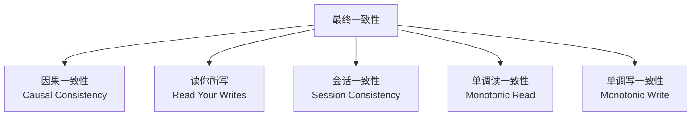

> 🎯 **本文目标**：从面试高频问题出发，深入剖析分布式系统的核心理论基础——CAP定理、BASE理论、一致性模型、时钟与网络问题，构建分布式系统面试的知识框架。

---

## 一、什么是分布式系统？

### 1.1 定义与核心特征

> **分布式系统**是若干独立计算机的集合，这些计算机对于用户来说就像是单个相关系统。

```
Q: 分布式系统和集群有什么区别？
```

| 维度 | 分布式系统 | 集群 |
|------|-----------|------|
| 核心目标 | 多节点协作完成一个任务 | 多节点提供相同服务 |
| 节点关系 | 各自承担不同职责 | 对等关系，互为冗余 |
| 通信方式 | 频繁的节点间通信与协调 | 主要通过负载均衡器 |
| 典型场景 | 电商系统（订单+库存+支付） | Web服务器集群 |
| 关键挑战 | 网络分区、一致性、共识 | 负载均衡、会话保持 |

### 1.2 分布式系统的核心挑战

```
┌─────────────────────────────────────────────┐
│            分布式系统八大谬误                  │
├─────────────────────────────────────────────┤
│ 1. 网络是可靠的                              │
│ 2. 延迟为零                                  │
│ 3. 带宽是无限的                              │
│ 4. 网络是安全的                              │
│ 5. 拓扑不会改变                              │
│ 6. 只有一个管理员                            │
│ 7. 传输成本为零                              │
│ 8. 网络是同质的                              │
└─────────────────────────────────────────────┘
```

**核心挑战总结：**

| 挑战 | 具体表现 | 应对手段 |
|------|---------|---------|
| 网络不可靠 | 丢包、延迟、乱序、分区 | 重试、超时、幂等 |
| 时钟不同步 | NTP偏差、时钟回拨 | 逻辑时钟、向量时钟 |
| 节点故障 | 进程崩溃、机器宕机 | 副本、心跳、自动切换 |
| 一致性难保证 | 副本间数据不一致 | 共识算法、分布式事务 |
| 并发冲突 | 多客户端同时写入 | 锁、版本号、MVCC |

---

## 二、CAP定理深度解析

### 2.1 CAP三要素

```
               ┌──────────┐
               │    C     │
               │ 一致性    │
               └────┬─────┘
                   /\
                  /  \
                 /    \
                /  CAP \
               /  三角  \
              /__________\
    ┌────────┐            ┌────────┐
    │   A    │────────────│   P    │
    │ 可用性  │            │分区容错 │
    └────────┘            └────────┘
```

> **CAP定理**：一个分布式系统最多只能同时满足一致性（Consistency）、可用性（Availability）和分区容错性（Partition Tolerance）中的两个。

**Q1: CAP三个字母分别代表什么？**

**C - Consistency（一致性）**
- 所有节点在同一时刻看到的数据完全相同
- 写操作完成后，后续所有读操作都能读到新值
- 相当于"线性一致性"（Linearizability）

**A - Availability（可用性）**
- 每个非故障节点都能在合理时间内返回合理的响应
- 不返回错误，不超时
- 即使部分节点故障，系统仍能正常服务

**P - Partition Tolerance（分区容错性）**
- 系统在任意网络分区故障下仍能继续运作
- 节点之间消息可能丢失或延迟，但系统不能崩溃
- 在分布式系统中，P是必须的（网络分区无法避免）

**Q2: 为什么CAP只能三选二？**

核心矛盾在于：**当网络分区发生时，必须在C和A之间做选择。**

```
场景：两个节点A和B之间网络断开（分区发生）

   Client1 ────► 节点A ◄──✗──► 节点B ◄──── Client2
                   │                │
                x = 1            x = 2

此时面临选择：
──────────────────────────────────────────────
选择CP（牺牲A）：
  → 节点B拒绝写入，系统不可用（部分）
  → 保证所有节点数据一致

选择AP（牺牲C）：
  → 节点B接受写入，系统可用
  → 但节点A和B数据不一致
──────────────────────────────────────────────
```

### 2.2 CAP的常见误解

**Q3: "CAP只能三选二"是准确的吗？**

不完全准确。更精确的说法是：

> 当网络分区（P）发生时，系统必须在C和A之间做取舍。在没有分区的情况下，系统可以同时满足C和A。

**关键纠正：**

| 误解 | 真相 |
|------|------|
| 系统整体选择CP或AP | 实际是**子系统**可以有不同的CAP取舍 |
| 选择CP就放弃A | CP系统只在分区时牺牲部分可用性 |
| CAP是互斥的 | CAP是**权衡**，不是非黑即白 |
| P是可选的 | P在分布式系统中是必须面对的 |

### 2.3 各主流系统的CAP分类

**Q4: 列举常见系统的CAP取舍？**

| 系统 | CAP类型 | 典型场景 | 取舍原因 |
|------|---------|---------|---------|
| ZooKeeper | **CP** | 配置管理、服务发现 | 强一致性保证，Leader宕机时短暂不可用 |
| etcd | **CP** | K8s配置存储 | Raft强一致性，选主期间不可写入 |
| Eureka | **AP** | 服务注册发现 | 优先保证可用，允许短暂不一致 |
| Nacos | CP+AP可切换 | 服务发现+配置 | 服务发现用AP，配置管理用CP |
| Redis Cluster | **AP** | 缓存集群 | 优先可用性，主从异步复制 |
| MySQL主从 | **AP** | 读写分离 | 从库延迟，牺牲强一致性 |
| MongoDB | **CP** (默认) | 文档数据库 | 写入关注majority，强一致 |
| Cassandra | **AP** | 宽表存储 | 最终一致性，可调一致性级别 |
| HBase | **CP** | 大数据存储 | 强一致性，RegionServer故障恢复中不可用 |

---

## 三、BASE理论

### 3.1 从ACID到BASE

> BASE理论是对CAP中AP方案的延伸，是**最终一致性**的实践指导。

```
ACID（传统关系型数据库）    →    BASE（分布式系统）
─────────────────────────────────────────────────
Atomicity    原子性           Basically Available  基本可用
Consistency  一致性           Soft State           软状态
Isolation    隔离性           Eventually Consistent 最终一致性
Durability   持久性
```

**Q5: BASE三个字母的含义？**

**BA - Basically Available（基本可用）**
- 系统出现故障时，允许损失部分可用性
- 如：响应时间变长（从50ms到2s）、功能降级（关闭非核心功能）

**S - Soft State（软状态）**
- 允许系统中的数据存在中间状态
- 中间状态不影响系统整体可用性
- 如：数据在多个副本间同步的过程中存在不一致窗口

**E - Eventually Consistent（最终一致性）**
- 系统中的所有副本，经过一段同步时间后，最终达到一致
- 不保证实时一致，但保证最终一致
- 如：DNS更新传播、MySQL主从同步

### 3.2 最终一致性的变体

**Q6: 最终一致性有哪些细分？**



| 变体 | 定义 | 举例 |
|------|------|------|
| **因果一致性** | 有因果关系的操作按序被看到 | 评论必须先于回复被看到 |
| **读你所写** | 用户总能看到自己写入的数据 | 发帖后立即能看到自己的帖子 |
| **会话一致性** | 同一会话内读你所写 | 同一连接内保证读你所写 |
| **单调读** | 不会读到比之前更旧的数据 | 一旦读到v2，不会回退到v1 |
| **单调写** | 同一进程的写操作被顺序执行 | 对同一数据的两次更新按序执行 |

---

## 四、一致性模型全景图

### 4.1 一致性谱系

```
强一致性 ◄──────────────────────────────────────────► 弱一致性
    │                                                      │
Linearizability  Sequential  Causal  PRAM   Read-Your-Writes  Eventual
（线性一致性）   （顺序一致性）（因果）  （PRAM）  （读你所写）      （最终）
```

**Q7: 线性一致性和顺序一致性有什么区别？**

| 维度 | 线性一致性 | 顺序一致性 |
|------|-----------|-----------|
| 全局时钟 | 需要全局物理时钟 | 不需要 |
| 操作顺序 | 按全局物理时间排序 | 按各节点程序顺序，全局交叉 |
| 实时性约束 | 必须满足实时顺序 | 不要求实时顺序 |
| 实现难度 | 极难（需要原子钟或GPS） | 相对容易 |
| 性能 | 差（需要同步等待） | 较好 |
| 代表系统 | Google Spanner | ZooKeeper |

### 4.2 分布式事务中的一致性

**Q8: 分布式事务如何实现一致性？**

```
强一致性方案：
├── 2PC/3PC（两阶段/三阶段提交）
├── XA分布式事务
└── Percolator（Google）

最终一致性方案：
├── TCC（Try-Confirm-Cancel）
├── Saga（补偿事务）
├── 本地消息表 + 定时任务
├── 事务消息（RocketMQ）
└── 可靠消息最终一致性
```

---

## 五、分布式系统中的时间与时钟

### 5.1 物理时钟的问题

**Q9: 为什么分布式系统不能依赖物理时钟？**

```
节点A时间：2026-06-27 10:00:00.000
节点B时间：2026-06-27 10:00:00.050  ← NTP偏差50ms

事件实际顺序：A写入 → B读取
但根据时钟：B的时间戳看起来在A之前！
```

**关键问题：**

| 问题 | 说明 |
|------|------|
| **NTP同步偏差** | 各节点与NTP服务器的偏差不同，通常几ms到几百ms |
| **时钟回拨** | NTP校准时可能将时钟往回拨，导致时间倒退 |
| **闰秒** | 全球统一调整的1秒，可能引发系统bug |
| **虚拟机时钟** | VM的时钟可能严重漂移 |

### 5.2 逻辑时钟

**Q10: Lamport逻辑时钟如何工作？**

```python
# Lamport逻辑时钟的核心规则
class LamportClock:
    def __init__(self):
        self.counter = 0
    
    def tick(self):
        """1. 每个进程内事件发生前，计数器+1"""
        self.counter += 1
    
    def send(self):
        """2. 发送消息时，将当前计数器值附在消息上"""
        self.tick()
        return self.counter
    
    def receive(self, received_ts):
        """3. 接收消息时，取max(local, received) + 1"""
        self.counter = max(self.counter, received_ts) + 1

# Lamport逻辑时钟保证：
# 如果事件a happen-before 事件b，则 C(a) < C(b)
# 但反过来不一定成立：C(a) < C(b) 不意味着 a happen-before b
```

**Q11: 向量时钟（Vector Clock）解决了什么问题？**

向量时钟可以检测事件的**并发关系**，而Lamport时钟只能检测happen-before关系。

```python
# 向量时钟示例
class VectorClock:
    def __init__(self, node_id, num_nodes):
        self.node_id = node_id
        self.clock = [0] * num_nodes
    
    def tick(self):
        self.clock[self.node_id] += 1
    
    def send(self):
        self.tick()
        return self.clock.copy()
    
    def receive(self, received_clock):
        self.clock[self.node_id] += 1
        for i in range(len(self.clock)):
            self.clock[i] = max(self.clock[i], received_clock[i])

# 比较两个向量时钟 [A:2, B:1, C:0] 和 [A:1, B:2, C:1]
# → 无法比较（存在并发），说明两个事件是并发的！
```

---

## 六、分布式系统的网络模型

### 6.1 三种网络模型

**Q12: 同步网络、异步网络、部分同步网络的区别？**

| 模型 | 特点 | 实际应用 |
|------|------|---------|
| **同步网络** | 消息延迟有已知上限，进程速度有界 | 极少（理论模型） |
| **异步网络** | 无任何时间假设，消息可能任意延迟 | FLP不可能性的前提 |
| **部分同步** | 大部分时间同步，偶尔异步 | **实用系统采用此模型** |

### 6.2 FLP不可能定理

**Q13: 什么是FLP不可能定理？**

> 在**异步通信**的分布式系统中，即使只有一个进程可能故障，也不存在一个**确定性算法**能在有限时间内达成共识。

**关键理解：**
- FLP说的是"在异步模型中不可能"，不是"在任何模型中都不可能"
- 实际系统通过引入**超时机制**（部分同步模型）绕过FLP
- Raft、Paxos等共识算法都在部分同步模型下工作
- FLP强调：不能区分"节点很慢"和"节点崩溃"

---

## 七、分布式系统面试高频问题

**Q14: 什么是脑裂（Split-Brain）？如何避免？**

> 脑裂：集群中多个节点同时认为自己是Leader，各自提供服务，导致数据不一致。

```
正常状态：              脑裂状态：
┌─────────┐            ┌─────────┐    ┌─────────┐
│ Leader  │            │ "Leader" │    │ "Leader" │
│ Node A  │            │  Node A  │    │  Node B  │
└─────────┘            └─────────┘    └─────────┘
    │                       │               │
┌───┴───┐              ┌───┴───┐       ┌───┴───┐
│Follower│              │ 分区A  │       │ 分区B  │
│ Node B │              └───────┘       └───────┘
└────────┘
```

**避免脑裂的方案：**

| 方案 | 原理 | 代表系统 |
|------|------|---------|
| **Quorum机制** | 需要过半数节点同意 | etcd(Raft)、ZooKeeper(ZAB) |
| **隔离(Fencing)** | 旧Leader发现fencing token过期后自杀 | Kafka、HDFS |
| **仲裁盘** | 共享存储做仲裁 | 传统HA集群 |
| **租约(Lease)** | Leader持有租约，过期自动释放 | ZooKeeper |

**Q15: 什么是Quorum机制？如何计算？**

```
Quorum公式：W + R > N

N = 副本总数
W = 写成功所需的最小副本数
R = 读成功所需的最小副本数

举例：N=3，W=2，R=2
→ 任意两个节点必有一个包含最新数据
→ 保证读写总能读到最新数据

常见配置：
- W=1, R=N → 写快读慢（写优化）
- W=N, R=1 → 写慢读快（读优化）
- W=Q, R=Q (Q = N/2+1) → 读写平衡
```

**Q16: 什么是拜占庭将军问题？**

> 在分布式系统中，如果存在恶意节点（不仅可能故障，还可能故意发送错误信息），如何达成共识？

| 维度 | 非拜占庭容错 | 拜占庭容错(BFT) |
|------|------------|----------------|
| 故障模型 | 崩溃故障(Crash Fault) | 任意故障(Byzantine Fault) |
| 节点数量 | 2f+1 | 3f+1 |
| 典型算法 | Paxos、Raft | PBFT、HotStuff |
| 应用场景 | 企业内部系统 | 区块链、跨组织协作 |
| 复杂度 | O(n) | O(n²)消息复杂度 |

---

## 八、实战：设计一个分布式ID生成器

**Q17: 面试官问：如何设计一个分布式ID生成器？请从CAP角度分析。**

```java
// 方案1：数据库自增ID（CP）
// → 牺牲可用性换取一致性，单点故障时不可用
// → 可通过号段模式（如美团Leaf）优化

// 方案2：UUID（AP）
// → 高可用，无中心节点
// → 牺牲了"有序性"一致性
String id = UUID.randomUUID().toString();
// 问题：无序、太长、不利于索引

// 方案3：Snowflake（AP）
// 雪花算法：41位时间戳 + 10位机器ID + 12位序列号
public class Snowflake {
    private long workerId;
    private long sequence = 0L;
    private long lastTimestamp = -1L;
    
    public synchronized long nextId() {
        long timestamp = System.currentTimeMillis();
        if (timestamp < lastTimestamp) {
            throw new RuntimeException("时钟回拨！");
        }
        if (timestamp == lastTimestamp) {
            sequence = (sequence + 1) & 4095;
            if (sequence == 0) {
                timestamp = tilNextMillis(lastTimestamp);
            }
        } else {
            sequence = 0L;
        }
        lastTimestamp = timestamp;
        return (timestamp << 22) | (workerId << 12) | sequence;
    }
}
// 优点：高性能、趋势递增
// 注意：时钟回拨问题需要处理
```

**CAP分析总结：**

| 方案 | CAP | 优势 | 劣势 |
|------|-----|------|------|
| 数据库自增 | CP | 严格递增 | 单点瓶颈 |
| UUID | AP | 无依赖 | 无序，太长 |
| Snowflake | AP | 高性能，趋势递增 | 时钟回拨 |
| 号段模式(Leaf) | AP | 高性能，有序 | 号码不连续 |
| Redis自增 | AP | 简单，有序 | 持久化恢复复杂 |

---

## 九、总结

| 主题 | 核心要点 |
|------|---------|
| CAP定理 | 分区发生时C和A二选一，P必须面对 |
| BASE理论 | 基本可用+软状态+最终一致性，AP的实践指导 |
| 一致性模型 | 强一致(Linearizability) → 最终一致(Eventual)的连续谱系 |
| 逻辑时钟 | Lamport检测happen-before，Vector Clock检测并发 |
| FLP定理 | 异步模型中不存在确定性共识算法 |
| 脑裂 | 通过Quorum(过半机制)和Fencing(隔离)避免 |
| Quorum | W+R>N保证读写强一致 |
| 拜占庭 | 3f+1节点容f个恶意节点，区块链核心技术 |

> 🎯 **分布式系统面试八股文系列开篇！** 本文从CAP定理、BASE理论、一致性模型、时钟与网络等核心基础出发，建立了分布式系统面试的底层知识框架。理解这些理论是后续深入学习一致性协议、共识算法、分布式事务的前提。

> 📌 **下期预告**：《分布式系统面试八股文（二）——一致性协议与共识算法》将深入2PC/3PC、Paxos、Raft、ZAB等核心共识协议的原理、对比与代码级实现，敬请期待！

---

*作者：李亚飞 · Raphael Lab*
