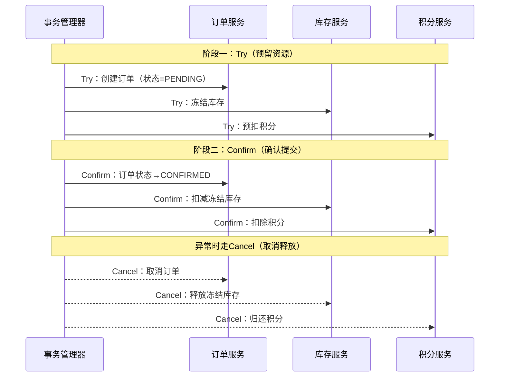
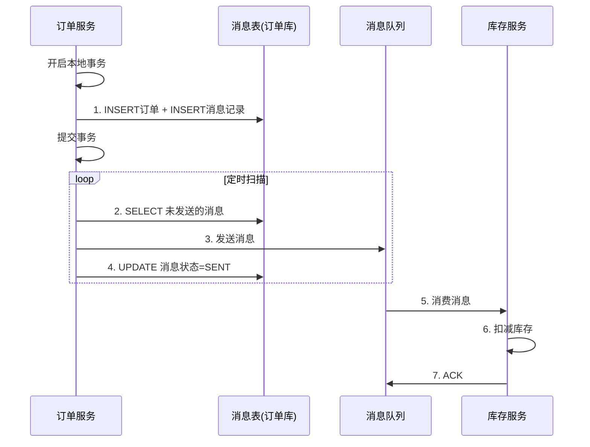

# 分布式系统面试八股文（三）——分布式事务与一致性解决方案

> 🎯 **本文目标**：承接前两篇的CAP理论与共识算法基础，深入剖析分布式事务的核心难题与解决方案——从严格的XA/2PC到柔性的TCC、SAGA、本地消息表、事务消息，再到Seata这样的工业级中间件，构建完整的分布式事务知识地图。

---

## 一、分布式事务的本质挑战

### 1.1 问题的起源

在单体应用中，数据库的ACID事务由本地事务管理器保证。当业务拆分为微服务后，一次业务操作横跨多个服务和数据库，如何保证数据一致性？

```
┌──────────────────────────────────────────────────────┐
│                   下单流程（电商系统）                    │
├──────────────────────────────────────────────────────┤
│                                                      │
│  订单服务 ─── 创建订单（减库存预占）                      │
│      │                                               │
│      ├── 库存服务 ─── 扣减真实库存                      │
│      │                                               │
│      ├── 支付服务 ─── 创建支付单                        │
│      │                                               │
│      ├── 积分服务 ─── 增加用户积分                      │
│      │                                               │
│      └── 物流服务 ─── 创建物流单                        │
│                                                      │
│  问题：如何保证这5个服务的数据一致性？                    │
└──────────────────────────────────────────────────────┘
```

**Q1: 分布式事务面临的核心问题是什么？**

| 问题 | 描述 | 影响 |
|------|------|------|
| **原子性** | 多个子事务要么全部成功，要么全部回滚 | 数据不一致 |
| **隔离性** | 并发事务间的相互影响 | 脏读、幻读 |
| **网络不确定性** | 网络超时、分区、丢包 | 状态不确定 |
| **参与者异构** | 不同数据库、不同服务 | 回滚机制不同 |
| **性能瓶颈** | 协调者单点、锁竞争 | 吞吐量下降 |

---

## 二、刚性事务：XA与2PC/3PC工程实践

### 2.1 XA规范与JTA

**Q2: XA规范是什么？如何在Java中实现？**

XA是X/Open组织定义的分布式事务处理模型（DTP），包含三个角色：

```
AP（应用程序）
    │
    ▼
TM（事务管理器） ── 协调者
    │
    ├── RM1（资源管理器）── MySQL（订单库）
    └── RM2（资源管理器）── MySQL（库存库）
```

**Java实现（JTA + Atomikos）：**

```java
@Configuration
public class XADataSourceConfig {
    
    @Bean("orderDataSource")
    public DataSource orderDataSource() {
        MysqlXADataSource xaDataSource = new MysqlXADataSource();
        xaDataSource.setUrl("jdbc:mysql://localhost:3306/order_db");
        xaDataSource.setUser("root");
        xaDataSource.setPassword("password");
        
        AtomikosDataSourceBean bean = new AtomikosDataSourceBean();
        bean.setXaDataSource(xaDataSource);
        bean.setUniqueResourceName("orderDataSource");
        bean.setPoolSize(10);
        return bean;
    }
    
    @Bean("inventoryDataSource")
    public DataSource inventoryDataSource() {
        MysqlXADataSource xaDataSource = new MysqlXADataSource();
        xaDataSource.setUrl("jdbc:mysql://localhost:3306/inventory_db");
        xaDataSource.setUser("root");
        xaDataSource.setPassword("password");
        
        AtomikosDataSourceBean bean = new AtomikosDataSourceBean();
        bean.setXaDataSource(xaDataSource);
        bean.setUniqueResourceName("inventoryDataSource");
        bean.setPoolSize(10);
        return bean;
    }
    
    @Bean
    public PlatformTransactionManager transactionManager(
            @Qualifier("orderDataSource") DataSource orderDS,
            @Qualifier("inventoryDataSource") DataSource inventoryDS) {
        return new JtaTransactionManager(orderDS, inventoryDS);
    }
}
```

**Q3: XA方案的优点和缺点？**

| 优点 | 缺点 |
|------|------|
| 严格ACID，强一致性 | 性能差，全局锁持有时间长 |
| 标准协议，数据库原生支持 | 单点故障（TM协调者） |
| 实现简单（相比柔性方案） | 不适合高并发场景 |
| 对业务代码侵入小 | 数据库需要支持XA（MySQL 5.7+） |

---

### 2.2 2PC在工程中的改进

**Q4: 如何解决2PC协调者单点问题？**

```
改进方案一：协调者主备模式

  协调者主 ── 心跳 ── 协调者备
    │                  │
    ├── RM1            ├── (待接管)
    └── RM2
```

**改进方案二：记录日志回放**

```java
// 协调者记录决策日志，故障后回放
public class LogBasedCoordinator {
    
    private static final String DECISION_LOG = "/data/tx/decisions.log";
    
    public void preparePhase(String txId) {
        // 写PREPARE日志（WAL）
        appendLog(txId, "PREPARE");
        
        boolean allReady = participants.stream()
            .allMatch(p -> p.prepare(txId));
        
        if (allReady) {
            appendLog(txId, "COMMIT");
            participants.forEach(p -> p.commit(txId));
        } else {
            appendLog(txId, "ROLLBACK");
            participants.forEach(p -> p.rollback(txId));
        }
    }
    
    // 启动时回放未完成的事务
    public void recover() {
        List<Decision> decisions = readLog(DECISION_LOG);
        for (Decision d : decisions) {
            if (d.status == "COMMIT" && !isCompleted(d.txId)) {
                participants.forEach(p -> p.commit(d.txId));
            }
        }
    }
}
```

---

## 三、柔性事务：TCC（Try-Confirm-Cancel）

### 3.1 TCC核心思想

**Q5: 什么是TCC？和2PC有什么区别？**

TCC将每个业务操作拆分为三个阶段，由**业务层**而非资源层实现：



**Q6: TCC vs 2PC 核心区别？**

| 维度 | 2PC | TCC |
|------|-----|-----|
| **实现层** | 资源管理器（数据库） | 业务层（应用代码） |
| **锁粒度** | 数据库行锁/表锁 | 业务字段（如冻结库存） |
| **性能** | 差（数据库锁） | 较好（业务隔离） |
| **一致性** | 强一致 | 最终一致 |
| **侵入性** | 低（数据库原生支持） | 高（每个接口都要实现） |
| **适用场景** | 短事务 | 长事务、高并发 |

### 3.2 TCC实战代码

```java
// ==================== 订单服务 ====================
@Service
public class OrderTccService {

    @Transactional
    public Order tryCreateOrder(CreateOrderRequest req) {
        // Try阶段：创建订单，状态=PENDING
        Order order = new Order();
        order.setOrderNo(generateOrderNo());
        order.setUserId(req.getUserId());
        order.setAmount(req.getAmount());
        order.setStatus(OrderStatus.PENDING);  // 暂态
        order.setTccPhase("TRY");
        orderMapper.insert(order);
        
        // 记录TCC日志（用于故障恢复）
        tccLogService.record("order", order.getOrderNo(), "TRY", req);
        return order;
    }
    
    @Transactional
    public void confirmCreateOrder(String orderNo) {
        // Confirm：状态改为CONFIRMED
        Order order = orderMapper.selectByOrderNo(orderNo);
        if (order.getStatus() == OrderStatus.PENDING) {
            orderMapper.updateStatus(orderNo, OrderStatus.CONFIRMED, "CONFIRM");
        }
    }
    
    @Transactional
    public void cancelCreateOrder(String orderNo) {
        // Cancel：状态改为CANCELED（释放冻结资源）
        Order order = orderMapper.selectByOrderNo(orderNo);
        if (order.getStatus() == OrderStatus.PENDING) {
            orderMapper.updateStatus(orderNo, OrderStatus.CANCELED, "CANCEL");
        }
    }
}

// ==================== 库存服务 ====================
@Service
public class InventoryTccService {

    @Transactional
    public boolean tryFreezeInventory(String orderNo, Long skuId, Integer quantity) {
        // Try：冻结库存（frozen_quantity + quantity, quantity - quantity）
        int affected = inventoryMapper.freeze(skuId, quantity);
        if (affected == 0) {
            return false;  // 库存不足
        }
        tccLogService.record("inventory", orderNo, "TRY", skuId, quantity);
        return true;
    }
    
    @Transactional
    public void confirmFreezeInventory(String orderNo) {
        // Confirm：扣减冻结库存
        TccLog log = tccLogService.get("inventory", orderNo);
        inventoryMapper.confirmFreeze(log.getSkuId(), log.getQuantity());
    }
    
    @Transactional
    public void cancelFreezeInventory(String orderNo) {
        // Cancel：解冻库存
        TccLog log = tccLogService.get("inventory", orderNo);
        inventoryMapper.unfreeze(log.getSkuId(), log.getQuantity());
    }
}

// ==================== TCC事务协调者 ====================
@Component
public class TccCoordinator {
    
    private Map<String, TccParticipant> participants = new LinkedHashMap<>();
    
    public TccCoordinator() {
        participants.put("order", orderTccService);
        participants.put("inventory", inventoryTccService);
        participants.put("points", pointsTccService);
    }
    
    @Transactional
    public boolean execute(String txId, TccRequest request) {
        // 阶段一：Try（按顺序预留）
        Map<String, Object> tryResults = new LinkedHashMap<>();
        try {
            for (Entry<String, TccParticipant> entry : participants.entrySet()) {
                Object result = entry.getValue().tryPhase(txId, request);
                if (result == null) throw new TccTryException(entry.getKey());
                tryResults.put(entry.getKey(), result);
            }
        } catch (Exception e) {
            // Try失败 → Cancel所有已Try的
            log.error("TCC Try failed at {}, rolling back", e.getMessage());
            for (String name : tryResults.keySet()) {
                try {
                    participants.get(name).cancelPhase(txId);
                } catch (Exception ex) {
                    log.error("Cancel failed for {}", name, ex);
                    // 记录失败，等待人工/定时任务补偿
                }
            }
            return false;
        }
        
        // 阶段二：Confirm（全部Try成功，逐Confirm）
        for (Entry<String, TccParticipant> entry : participants.entrySet()) {
            try {
                entry.getValue().confirmPhase(txId);
            } catch (Exception e) {
                log.error("Confirm failed for {}, starting compensation", entry.getKey());
                // Confirm失败 → 需要补偿机制（重试或人工介入）
                compensate(txId, entry.getKey());
            }
        }
        return true;
    }
}
```

**Q7: TCC的空回滚、悬挂、幂等性怎么处理？**

| 问题 | 描述 | 解决方案 |
|------|------|----------|
| **空回滚** | Try未执行，Cancel被调用（网络超时重试） | Cancel前查TCC日志，无Try记录则直接返回成功 |
| **悬挂** | Cancel先于Try到达 | Try阶段先检查是否有Cancel记录，有则拒绝执行 |
| **幂等** | 重复Try/Confirm/Cancel | 基于事务ID+阶段去重（防悬挂表） |

```java
// 防悬挂控制表
CREATE TABLE tcc_transaction (
    tx_id        VARCHAR(64) PRIMARY KEY,
    status       TINYINT NOT NULL COMMENT '0-TRY, 1-CONFIRMED, 2-CANCELED',
    create_time  DATETIME,
    update_time  DATETIME
);

// 空回滚处理
public void cancelPhase(String txId) {
    TccTransaction tx = tccMapper.selectByTxId(txId);
    if (tx == null) {
        // 空回滚：记录一条CANCELED记录，防止后续Try执行
        tccMapper.insert(txId, CANCELED);
        return;
    }
    if (tx.getStatus() == CONFIRMED) {
        throw new BizException("已确认，不可取消");
    }
    // 正常Cancel
    doCancel(txId);
    tccMapper.updateStatus(txId, CANCELED);
}

// 防悬挂
public void tryPhase(String txId) {
    TccTransaction tx = tccMapper.selectByTxId(txId);
    if (tx != null && tx.getStatus() == CANCELED) {
        throw new BizException("事务已取消（防悬挂）");
    }
    // 正常Try
    doTry(txId);
    tccMapper.insert(txId, TRY);
}
```

---

## 四、SAGA模式

### 4.1 核心原理

**Q8: SAGA模式是什么？什么场景下使用？**

SAGA将一个长事务拆分为多个本地事务，每个本地事务有对应的**补偿事务**。如果某一步失败，按**逆序**执行已成功步骤的补偿操作。

```
正向流程：  T1 → T2 → T3 → T4
               │         │
               ▼         ▼
补偿流程：  C1 ← C2 ← C3 ← C4（逆序补偿）
```

**适用场景**：
- 长事务（秒级到分钟级）
- 参与者无法提供TCC接口
- 老系统改造，无法大改
- 外部API调用（如银行转账）

### 4.2 两种协调模式

**Q9: SAGA的编排模式和协同模式有什么区别？**

```
编排模式（Orchestration）：
┌──────────────────────────────────────┐
│           Saga Orchestrator          │
│                                      │
│  Step1: 创建订单 ──→ Step2: 扣库存    │
│    │       失败?         │     失败?   │
│    ▼                    ▼            │
│  Comp1: 取消订单 ← Comp2: 恢复库存    │
└──────────────────────────────────────┘

协同模式（Choreography）：
事件驱动，各服务自治：

订单服务 ──"订单已创建"──→ 库存服务 ──"库存已扣"──→ 支付服务
    ▲                         │                        │
    │     "库存扣减失败"       │                        │
    └─────────────────────────┘                        │
    ▲              "支付失败"                           │
    └──────────────────────────────────────────────────┘
```

| 维度 | 编排模式 | 协同模式 |
|------|----------|----------|
| **中心化** | 有编排器 | 无中心节点 |
| **耦合度** | 编排器依赖所有服务 | 服务间松耦合 |
| **可观测性** | 编排器一目了然 | 需要额外追踪 |
| **复杂度** | 编排器逻辑复杂 | 事件链路难追踪 |
| **适用场景** | 流程固定、步骤少 | 流程多变、参与者多 |

### 4.3 SAGA实战

```java
@SagaOrchestrator
public class CreateOrderSaga {
    
    @Autowired private OrderService orderService;
    @Autowired private InventoryService inventoryService;
    @Autowired private PaymentService paymentService;
    @Autowired private PointsService pointsService;
    
    public void execute(OrderRequest req) {
        SagaContext ctx = new SagaContext();
        
        // Step 1: 创建订单
        try {
            Order order = orderService.create(req);
            ctx.setOrderId(order.getId());
        } catch (Exception e) {
            // 第一步失败，无需补偿
            throw new SagaException("create order failed", e);
        }
        
        // Step 2: 扣库存
        try {
            inventoryService.deduct(req.getSkuId(), req.getQty());
            ctx.markStep("inventory_deducted");
        } catch (Exception e) {
            // 补偿Step1
            orderService.cancel(ctx.getOrderId());
            throw new SagaException("deduct inventory failed", e);
        }
        
        // Step 3: 创建支付单
        try {
            Payment payment = paymentService.create(ctx.getOrderId(), req.getAmount());
            ctx.setPaymentId(payment.getId());
            ctx.markStep("payment_created");
        } catch (Exception e) {
            // 逆序补偿
            inventoryService.restore(req.getSkuId(), req.getQty());
            orderService.cancel(ctx.getOrderId());
            throw new SagaException("create payment failed", e);
        }
        
        // Step 4: 增加积分
        try {
            pointsService.add(req.getUserId(), req.getAmount() / 100);
            ctx.markStep("points_added");
        } catch (Exception e) {
            // Step4失败补偿Step3→Step2→Step1
            paymentService.cancel(ctx.getPaymentId());
            inventoryService.restore(req.getSkuId(), req.getQty());
            orderService.cancel(ctx.getOrderId());
            // 积分失败不阻塞主流程，可降级
            log.warn("points add failed, order still success");
        }
    }
}
```

---

## 五、最终一致性方案

### 5.1 本地消息表

**Q10: 本地消息表是如何保证最终一致性的？**

核心思想：将业务操作和消息记录放在**同一本地事务**中，然后用定时任务扫描发送。



```sql
-- 本地消息表
CREATE TABLE event_message (
    id          BIGINT AUTO_INCREMENT PRIMARY KEY,
    message_id  VARCHAR(64) NOT NULL UNIQUE,
    topic       VARCHAR(128) NOT NULL,
    tag         VARCHAR(128),
    message_key VARCHAR(256),
    body        TEXT NOT NULL COMMENT '消息体JSON',
    status      TINYINT DEFAULT 0 COMMENT '0-待发送, 1-已发送, 2-消费失败',
    retry_count INT DEFAULT 0,
    max_retry   INT DEFAULT 10,
    next_retry  DATETIME COMMENT '下次重试时间',
    create_time DATETIME DEFAULT CURRENT_TIMESTAMP,
    update_time DATETIME DEFAULT CURRENT_TIMESTAMP ON UPDATE CURRENT_TIMESTAMP,
    INDEX idx_status_time (status, create_time)
) ENGINE=InnoDB;
```

```java
@Service
public class OrderService {
    
    @Transactional
    public void createOrder(OrderRequest req) {
        // 1. 业务操作
        Order order = new Order(req);
        orderMapper.insert(order);
        
        // 2. 写入消息表（同一事务）
        EventMessage msg = new EventMessage();
        msg.setMessageId(UUID.randomUUID().toString());
        msg.setTopic("ORDER");
        msg.setTag("CREATED");
        msg.setBody(JSON.toJSONString(order));
        msg.setStatus(0);
        eventMessageMapper.insert(msg);
    }
}

// 定时任务：扫描并发送
@Component
public class MessageRelayTask {
    
    @Scheduled(fixedDelay = 5000)  // 每5秒
    public void relayMessages() {
        List<EventMessage> messages = eventMessageMapper.selectPending(
            EventStatus.PENDING, 
            100  // 批量大小
        );
        
        for (EventMessage msg : messages) {
            try {
                SendResult result = rocketMQTemplate.syncSend(
                    msg.getTopic() + ":" + msg.getTag(),
                    MessageBuilder.withPayload(msg.getBody())
                        .setMessageId(msg.getMessageId())
                        .build()
                );
                
                if (result.getSendStatus() == SendStatus.SEND_OK) {
                    eventMessageMapper.updateStatus(msg.getId(), EventStatus.SENT);
                }
            } catch (Exception e) {
                log.error("Message relay failed: {}", msg.getMessageId(), e);
                // 超过最大重试次数 → 告警
                if (msg.getRetryCount() >= msg.getMaxRetry()) {
                    alertService.alert("消息发送失败", msg);
                    eventMessageMapper.updateStatus(msg.getId(), EventStatus.FAILED);
                } else {
                    eventMessageMapper.incrementRetry(msg.getId());
                }
            }
        }
    }
}
```

### 5.2 RocketMQ事务消息

**Q11: RocketMQ事务消息的原理？**

```
执行流程：

Producer                    RocketMQ Broker                Consumer
   │                             │                            │
   │──① Send Half Message───────→│                            │
   │                             │（状态：半消息，不可见）       │
   │←② Send OK──────────────────│                            │
   │                             │                            │
   │──③ Execute Local Tx────────│                            │
   │   (执行业务逻辑)              │                            │
   │                             │                            │
   │──④ Commit/Rollback────────→│                            │
   │                             │（Commit→可见，Rollback→删除）│
   │                             │                            │
   │                             │──⑤ Push Message───────────→│
   │                             │                            │──⑥ Consume
   │                             │                            │
   │                             │──⑦ 事务回查（超时未收到④）──→│
   │←⑧ Check Local Tx Status────│                            │
   │──⑨ Commit/Rollback────────→│                            │
```

```java
@Component
public class OrderTransactionListener implements TransactionListener {
    
    @Autowired private OrderService orderService;
    
    @Override
    public LocalTransactionState executeLocalTransaction(Message msg, Object arg) {
        OrderRequest req = (OrderRequest) arg;
        try {
            // 执行本地事务
            orderService.createOrder(req);
            return LocalTransactionState.COMMIT_MESSAGE;
        } catch (Exception e) {
            log.error("Local transaction failed", e);
            return LocalTransactionState.ROLLBACK_MESSAGE;
        }
    }
    
    @Override
    public LocalTransactionState checkLocalTransaction(MessageExt msg) {
        String orderId = msg.getKeys();
        Order order = orderService.getByOrderId(orderId);
        
        if (order != null && order.getStatus() == OrderStatus.CONFIRMED) {
            return LocalTransactionState.COMMIT_MESSAGE;
        } else if (order == null) {
            return LocalTransactionState.ROLLBACK_MESSAGE;
        } else {
            return LocalTransactionState.UNKNOW;
        }
    }
}

// 发送事务消息
@Autowired private RocketMQTemplate rocketMQTemplate;

public void sendOrderCreatedEvent(Order order) {
    Message<String> msg = MessageBuilder.withPayload(JSON.toJSONString(order))
        .setTransactionId(order.getOrderId())
        .setKeys(order.getOrderId())
        .build();
    
    TransactionSendResult result = rocketMQTemplate.sendMessageInTransaction(
        "order-tx-group",
        "ORDER:CREATED",
        msg,
        order  // arg参数
    );
    
    log.info("Transaction message result: {}", result.getLocalTransactionState());
}
```

### 5.3 最大努力通知

**Q12: 最大努力通知适用于什么场景？**

适用于**外部系统集成**场景（如支付宝回调），特点：
- 业务发起方通知外部系统
- 不可靠通信（HTTP回调）
- 有**通知上限**（重试次数或期限）
- 不做数据校对（另一套对账系统）

```java
@Component
public class BestEffortNotificationService {
    
    private static final int MAX_RETRY = 5;
    private static final long RETRY_INTERVAL_MINUTES = 1;  // 指数退避
    
    public void notify(String url, Object payload) {
        Notification notification = new Notification();
        notification.setId(UUID.randomUUID().toString());
        notification.setUrl(url);
        notification.setPayload(JSON.toJSONString(payload));
        notification.setStatus(NotifyStatus.PENDING);
        notification.setNextRetry(new Date());
        notificationMapper.insert(notification);
        
        // 异步通知
        taskExecutor.execute(() -> doNotify(notification));
    }
    
    private void doNotify(Notification notification) {
        for (int i = 0; i < MAX_RETRY; i++) {
            try {
                ResponseEntity<String> resp = restTemplate.postForEntity(
                    notification.getUrl(),
                    notification.getPayload(),
                    String.class
                );
                
                if (resp.getStatusCode() == HttpStatus.OK 
                        && "success".equals(resp.getBody())) {
                    notificationMapper.updateStatus(notification.getId(), NotifyStatus.SUCCESS);
                    return;
                }
            } catch (Exception e) {
                log.warn("Notify attempt {} failed for {}", i + 1, notification.getId());
            }
            
            // 指数退避: 1min, 2min, 4min, 8min, 16min
            long delay = RETRY_INTERVAL_MINUTES * (long) Math.pow(2, i);
            try {
                Thread.sleep(delay * 60 * 1000);
            } catch (InterruptedException e) {
                Thread.currentThread().interrupt();
            }
        }
        
        // 达到上限 → 告警
        notificationMapper.updateStatus(notification.getId(), NotifyStatus.FAILED);
        alertService.alert("通知失败，已达最大重试次数", notification);
    }
}
```

---

## 六、Seata：工业级分布式事务中间件

### 6.1 Seata架构

**Q13: Seata的AT模式是如何工作的？**

Seata（Simple Extensible Autonomous Transaction Architecture）提供四种模式，其中AT模式是**无侵入**的自动补偿方案。

```
Seata架构三组件：

         TM（事务管理器）          RM（资源管理器）
    ┌──────────────┐      ┌──────────────────────┐
    │ begin/commit │      │ 注册分支事务           │
    │   /rollback  │      │ 报告分支状态           │
    └──────┬───────┘      └──────────┬───────────┘
           │                        │
           └────────┬───────────────┘
                    │
                    ▼
           ┌────────────────┐
           │   TC（事务协调者）│
           │   - 全局事务管理  │
           │   - 分支事务注册  │
           │   - 全局锁管理    │
           │   - 提交/回滚决策 │
           └────────────────┘
```

**AT模式核心流程（一阶段自动提交，二阶段异步）：**

```
一阶段：
  ┌──────────────────────────────────────────┐
  │ 业务SQL: UPDATE account SET money =       │
  │           money - 100 WHERE id = 1        │
  ├──────────────────────────────────────────┤
  │ 1. 解析SQL，获取before-image              │
  │    SELECT * FROM account WHERE id = 1     │
  │    → {id:1, money:500}                    │
  │                                            │
  │ 2. 执行业务SQL                             │
  │    → {id:1, money:400}                    │
  │                                            │
  │ 3. 查询after-image                        │
  │    SELECT * FROM account WHERE id = 1     │
  │    → {id:1, money:400}                    │
  │                                            │
  │ 4. 记录undo_log（回滚日志）                │
  │    INSERT INTO undo_log (                 │
  │      branch_id, xid,                      │
  │      rollback_info: {before, after}        │
  │    )                                       │
  │                                            │
  │ 5. 提交本地事务（AT模式下自动提交）         │
  └──────────────────────────────────────────┘

二阶段（提交）：
  TC通知→异步删除undo_log

二阶段（回滚）：
  TC通知→根据undo_log的before-image反向补偿
  UPDATE account SET money = 500 WHERE id = 1
```

```java
// Seata AT模式使用示例（对业务代码零侵入）
@Service
public class OrderService {
    
    @GlobalTransactional(name = "create-order", timeoutMills = 300000)
    public void createOrder(OrderRequest req) {
        // 本地事务1：创建订单
        orderMapper.insert(order);
        
        // 远程调用：扣库存（Seata自动传播xid）
        inventoryFeignClient.deduct(req.getProductId(), req.getCount());
        
        // 远程调用：扣余额
        accountFeignClient.debit(req.getUserId(), req.getAmount());
        
        // 所有操作成功 → TC驱动全局提交
        // 任何一步失败 → TC驱动全局回滚
    }
}
```

### 6.2 四种模式对比

**Q14: Seata的AT、TCC、SAGA、XA模式各有什么优缺点？**

| 模式 | 一致性 | 性能 | 侵入性 | 适用场景 | 补偿方式 |
|------|--------|------|--------|----------|----------|
| **AT** | 最终一致 | 高 | 无（自动） | 关系型数据库 | 自动undo_log回滚 |
| **TCC** | 最终一致 | 高 | 高（需实现） | 高并发、有资源预留 | 业务Cancel方法 |
| **SAGA** | 最终一致 | 高 | 中（需补偿） | 长事务、老系统 | 正向补偿方法 |
| **XA** | 强一致 | 低 | 无 | 强一致性要求 | 数据库自动回滚 |

### 6.3 Seata AT模式的坑

**Q15: AT模式有哪些常见问题和解决方案？**

| 问题 | 描述 | 解决方案 |
|------|------|----------|
| **脏写** | 全局事务未提交，其他事务修改了同一行 | 全局锁（Seata自动SELECT FOR UPDATE） |
| **镜像校验失败** | 一阶段后、二阶段前，数据被修改 | 二阶段回滚时检查after-image是否匹配 |
| **undo_log膨胀** | 大事务大量before/after镜像 | 定期清理+异步删除 |
| **性能损耗** | 每次SQL都要解析和镜像 | 只对必要方法加@GlobalTransactional |
| **不支持非关系型DB** | AT强依赖SQL解析 | 改用TCC或SAGA模式 |

```yaml
# application.yml - Seata配置
seata:
  tx-service-group: my_tx_group
  service:
    vgroup-mapping:
      my_tx_group: default
    grouplist:
      default: 127.0.0.1:8091
  config:
    type: nacos
    nacos:
      server-addr: 127.0.0.1:8848
      group: SEATA_GROUP
  
  # AT模式undo_log配置
  client:
    undo:
      log-table: undo_log
      only-caret-update-columns: true
```

---

## 七、方案选型决策树

```
                         分布式事务需求
                              │
                是否需要强一致性？
                ┌──────┴──────┐
               是             否
                │              │
           XA/2PC         性能要求高？
                │         ┌──────┴──────┐
                          高             一般
                          │              │
                   能否改造实现TCC？  短事务？
                   ┌──────┴──────┐  ┌──┴──┐
                   能            否  是    否
                    │             │   │     │
                  TCC       数据库？ 本地   SAGA
                    │        ┌─┴─┐  消息表        │
                  高并发    是   否        老系统
                  强业务  AT模式  可靠消息  外部调用
```

**面试话术**：
> "在分布式事务选型上，我遵循'能最终一致不强一致，能不分布式就不分布式'的原则。大多数互联网场景优先考虑最终一致性方案：如果团队能接受业务侵入，TCC是最佳选择；如果追求零侵入且使用关系型数据库，Seata AT模式是首选；如果有长事务场景，SAGA最为合适。只有金融核心系统等强一致场景才考虑XA。"

---

## 八、面试高频问题速览

| # | 问题 | 难度 | 关键点 |
|---|------|------|--------|
| 1 | 2PC和3PC的区别？ | ⭐⭐ | 3PC引入超时+预提交，解决阻塞 |
| 2 | TCC和2PC的核心区别？ | ⭐⭐⭐ | 业务层vs资源层，性能vs一致性 |
| 3 | TCC空回滚、悬挂、幂等怎么处理？ | ⭐⭐⭐⭐ | 防悬挂表+TCC日志 |
| 4 | Seata AT原理？ | ⭐⭐⭐⭐ | 一阶段自动提交+undo_log |
| 5 | 本地消息表vs事务消息选型？ | ⭐⭐⭐ | 适用场景、可靠性 |
| 6 | 分布式事务CAP如何权衡？ | ⭐⭐⭐ | 多数场景CP/AP，少数场景CA |
| 7 | SAGA补偿失败怎么办？ | ⭐⭐⭐⭐ | 重试+告警+人工介入 |
| 8 | RocketMQ事务消息回查机制？ | ⭐⭐⭐ | 半消息+TransactionListener |

---

## 九、总结

分布式事务是分布式系统中最具挑战性的话题之一。从刚性事务（XA/2PC）到柔性事务（TCC/SAGA/消息方案），再到工业级中间件（Seata），理解每种方案的**权衡取舍**（Trade-off）比记住实现细节更重要。

**核心要点**：
1. **2PC**：强一致但性能差，被3PC改进但仍有限制
2. **TCC**：业务层实现，高性能但侵入性强，需处理空回滚/悬挂/幂等
3. **SAGA**：长事务首选，补偿模式灵活
4. **本地消息表**：简单可靠的最终一致性方案
5. **事务消息**：RocketMQ的半消息+回查机制
6. **Seata**：AT模式零侵入，TCC模式高灵活

> 📚 **下期预告**：《分布式系统面试八股文（四）——分布式存储与数据库中间件》，深入解析分库分表、读写分离、分布式数据库（TiDB/OceanBase）、分布式缓存架构与数据迁移策略，敬请期待！
