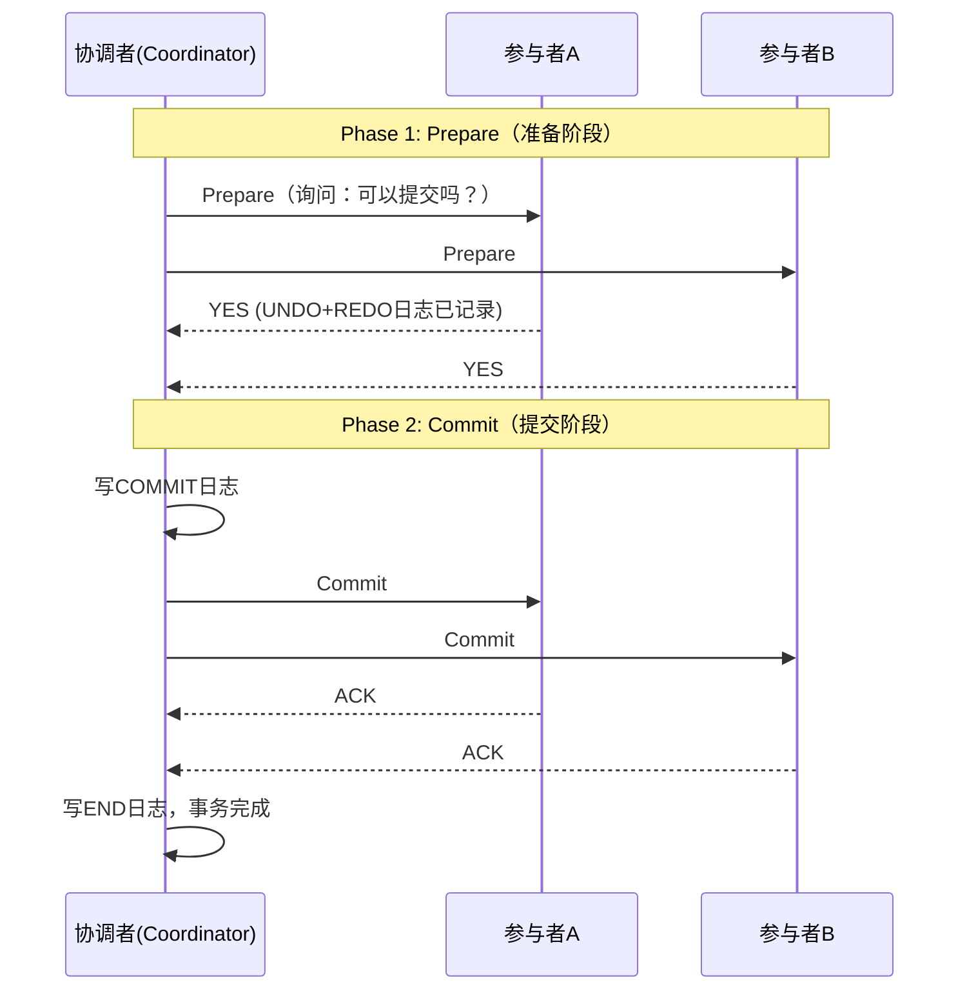
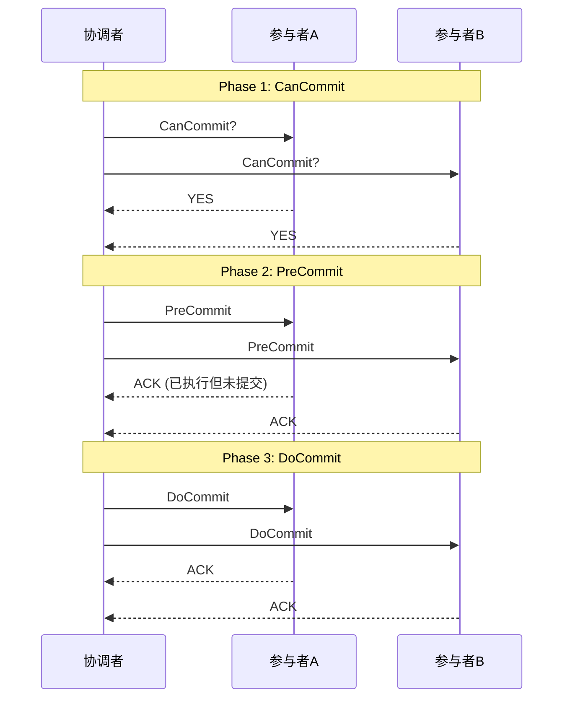
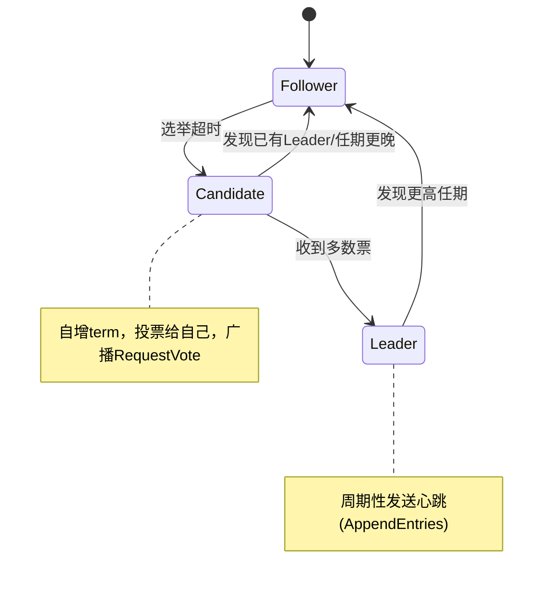

# 分布式系统面试八股文（二）——一致性协议与共识算法

> 🎯 **本文目标**：从面试高频问题出发，深入对比分析2PC/3PC、Paxos、Raft、ZAB等核心一致性协议和共识算法的原理、演进与工程实践，掌握面试官最常问的分布式共识知识点。

---

## 一、一致性协议概述

### 1.1 问题的本质

在分布式系统中，**共识（Consensus）** 是指多个节点对一个值达成一致。这是分布式系统最核心、最困难的问题之一。

```
共识算法的演进路径：

2PC → 3PC → Paxos → Multi-Paxos → Raft → ZAB
 │       │       │          │           │       │
简单    改进    理论奠基    工程化     易理解   工业级
阻塞    非阻塞  难实现    可落地      标准化   强一致
```

**Q1: 为什么需要共识算法？**

| 场景 | 需要达成共识的内容 |
|------|-------------------|
| Leader选举 | 谁是Leader |
| 分布式事务 | 事务是否提交 |
| 配置管理 | 配置的最新值 |
| 分布式锁 | 谁持有锁 |
| 日志复制 | 日志的顺序和内容 |
| 元数据管理 | 集群拓扑信息 |

---

## 二、2PC与3PC —— 分布式事务的基础

### 2.1 两阶段提交（2PC）

**Q2: 详细描述2PC的执行流程？**



**每个阶段的详细过程：**

| 阶段 | 协调者 | 参与者 |
|------|--------|--------|
| **Phase 1** | 发送Prepare → 等待所有回复 | 执行事务但不提交，记录UNDO/REDO日志 |
| **Phase 2 (全部YES)** | 写Commit日志 → 发送Commit → 等ACK | 提交事务 → 释放锁 → 返回ACK |
| **Phase 2 (任一NO)** | 写Abort日志 → 发送Rollback → 等ACK | 回滚事务 → 释放锁 → 返回ACK |

**Q3: 2PC有什么致命缺陷？**

```
2PC的三大问题：
──────────────────────────────────────────────
1️⃣  同步阻塞（性能问题）
    所有参与者在Prepare之后等待协调者指令
    锁资源在整个等待期间被持有
    其他事务无法访问被锁定的数据

2️⃣  单点故障（可靠性问题）
    协调者宕机 → 参与者无限等待 → 整个系统阻塞
    参与者无法互相通信来决定提交还是回滚
    
3️⃣  数据不一致（一致性问题）
    协调者发送部分Commit后宕机
    → 收到Commit的参与者提交了
    → 没收到Commit的参与者保持锁定状态
    → 数据不一致！
──────────────────────────────────────────────
```

### 2.2 三阶段提交（3PC）

**Q4: 3PC如何改进2PC？**

3PC在2PC的基础上增加了**预提交阶段**，并引入**超时机制**。



**2PC vs 3PC 对比：**

| 维度 | 2PC | 3PC |
|------|-----|-----|
| 阶段数 | 2 | 3（CanCommit + PreCommit + DoCommit） |
| 超时处理 | 无超时机制 | 参与者有超时，超时后自动提交 |
| 阻塞性 | 强阻塞 | 降低阻塞概率 |
| 数据一致性 | 可能不一致 | 更好，但仍无法完全避免 |
| 网络开销 | 低 | 高（多一轮通信） |
| 实际应用 | XA事务 | 极少使用 |

**Q5: 为什么3PC没有广泛使用？**

```
3PC的问题：
1. 网络分区时仍可能不一致
   → 如果PreCommit阶段有网络分区，一部分超时提交，一部分回滚

2. 增加了一轮通信开销
   → 延迟增加约50%

3. 前提假设不现实
   → 假设网络分区但所有节点存活
   → 实际中很难区分"节点故障"和"网络分区"
```

---

## 三、Paxos —— 共识算法的理论基石

### 3.1 Basic Paxos

**Q6: 解释Basic Paxos的角色和两阶段流程？**

```
Paxos的三个角色：
┌─────────────┐
│  Proposer   │ ← 提案者：提出提案(值)
│  (提议者)    │
└─────────────┘
┌─────────────┐
│  Acceptor   │ ← 接受者：对提案投票
│  (接受者)    │
└─────────────┘
┌─────────────┐
│  Learner    │ ← 学习者：学习被选定的值
│  (学习者)    │
└─────────────┘

一个节点可以同时扮演多个角色
```

**Basic Paxos的两阶段流程：**

```
Phase 1: Prepare（准备阶段）
────────────────────────────────────────────
Proposer: 生成提案号n，向多数派Acceptor广播Prepare(n)
Acceptor: 
  - 如果n > 已承诺的最大提案号:
    承诺不再接受 < n 的提案
    回复: (已接受的最大编号提案, 已接受的值)
  - 否则: 拒绝

Phase 2: Accept（接受阶段）
────────────────────────────────────────────
Proposer: 
  - 如果收到多数派回复:
    选取回复中编号最大的提案的值v（若没有则为自己的值）
    向多数派Acceptor广播Accept(n, v)
Acceptor:
  - 如果n >= 已承诺的提案号:
    接受提案，回复ACK
  - 否则: 拒绝

最终: 多数派接受后，提案被选定(Chosen)
```

**Q7: 为什么Paxos需要两阶段，而不是一阶段？**

```
关键场景：多个Proposer同时提案

如果只有一阶段（直接Accept）：
  时刻T1: Proposer A → Accept(1, "foo") → Acceptor1接受
  时刻T2: Proposer B → Accept(2, "bar") → Acceptor2接受
  时刻T3: Proposer A → Accept(1, "foo") → Acceptor3接受
  
  → Acceptor1有值"foo"，Acceptor2有值"bar"，Acceptor3有值"foo"
  → 没有多数派！死锁！

两阶段的作用：
  Phase 1: 发现之前已被选定的值（可能多数派已选定），强制使用该值
  Phase 2: 基于Phase 1的结果，确保安全地提出新值
```

### 3.2 Multi-Paxos

**Q8: Basic Paxos和Multi-Paxos的区别？**

| 维度 | Basic Paxos | Multi-Paxos |
|------|------------|-------------|
| 目标 | 就单个值达成共识 | 就一系列值(日志)达成共识 |
| 流程 | 每次两轮RPC | 选Leader后只需一轮RPC |
| Leader | 每次选举 | 长期Leader(租约) |
| Phase 1 | 每次都执行 | 只在Leader选举时执行 |
| 实际应用 | 理论算法 | 实际系统(ZooKeeper, Chubby) |

```
Multi-Paxos的优化核心：减少Prepare阶段的次数

Basic Paxos (每个值):
  Prepare → Accept → 选定一个值
  Prepare → Accept → 选定下一个值
  (每次都需要两轮RPC)

Multi-Paxos (选举Leader后):
  选举Leader: Prepare(空Accept)一次
  ┌─────────────────────────────┐
  │ 连续执行Accept → 选定一批值   │ ← 每个值只需一轮RPC！
  │ Accept → Accept → Accept    │
  └─────────────────────────────┘
```

---

## 四、Raft —— 可理解性优先的共识算法

### 4.1 Raft核心机制

> Raft的设计哲学：**把共识分解为独立子问题**，降低理解复杂度。

**Q9: Raft的三大子问题是什么？**

```
Raft三大子问题：

1️⃣  Leader选举（Leader Election）
    节点角色：Leader / Follower / Candidate
    选举超时 → Candidate → 请求投票 → 过半当选

2️⃣  日志复制（Log Replication）
    Leader接收写请求 → 追加日志 → 同步Follower → 过半提交

3️⃣  安全性（Safety）
    选举限制（日志不能比Candidate旧）
    提交规则（只能提交当前任期的日志 → 间接提交旧日志）
```

### 4.2 Leader选举详解

**Q10: Raft如何选举Leader？**



```
选举过程详解：
──────────────────────────────────────────────
1. Follower选举超时(150-300ms随机)，转为Candidate
2. Candidate:
   - term++
   - 投票给自己
   - 重置选举计时器
   - 向所有节点发送RequestVote RPC
3. 收到RequestVote的节点：
   - 如果term < currentTerm: 拒绝
   - 如果还没投票 或 已投票给相同term的此候选人: 投票
   - 如果日志不够新: 拒绝（安全性约束）
4. Candidate：
   - 获得多数票 → 成为Leader
   - 收到更高term的消息 → 退回Follower
   - 超时没有结果 → term++ 重新选举
5. Leader周期性发送心跳(50ms)维持统治
```

**Q11: Raft如何防止多个Candidate同时选举？（Split Vote）**

```
Split Vote场景：
  3个节点同时超时 → 同时成为Candidate → 票数分散 → 无人获得多数

Raft的解决：随机选举超时
────────────────────────────────────────────
- 每个节点的选举超时 = baseline + random(0~150ms)
- baseline通常150ms-300ms
- 不同节点几乎不可能同时超时
- 先超时的节点优先发起选举，更可能当选
```

### 4.3 日志复制详解

**Q12: Raft日志复制的完整流程？**

```java
// Raft日志条目结构
class LogEntry {
    long term;      // 创建该条目时的任期号
    int index;      // 条目在日志中的位置
    byte[] command; // 客户端请求的数据
}

// Raft Leader处理写请求的流程
class RaftLogReplication {
    // Step 1: Leader收到客户端写请求
    void handleClientWrite(Request req) {
        LogEntry entry = new LogEntry(currentTerm, nextIndex, req.data);
        // Step 2: 追加到本地日志（未提交）
        log.append(entry);
        
        // Step 3: 并行发送AppendEntries给所有Follower
        for (Node follower : followers) {
            sendAppendEntries(follower, entry);
        }
        
        // Step 4: 等待多数派确认
        int acks = countAcks();
        if (acks > nodesCount / 2) {
            // Step 5: 提交日志，应用到状态机
            commit(entry.index);
            applyToStateMachine(entry);
            
            // Step 6: 返回客户端成功
            replyClient(true);
            
            // Step 7: Leader通过后续心跳通知Follower提交
            // (Follower在收到新commitIndex时提交之前等待的日志)
        }
    }
}
```

```
日志复制的一致性保证：

    1   2   3   4   5   6   7   ← 日志索引
A: [ 1,  1,  2,  3,  3,  3,  3]  ← Leader (节点A的日志)
B: [ 1,  1,  2]                    ← Follower B落后
C: [ 1,  1,  2,  3,  3]           ← Follower C稍有落后

Raft保证：
1. 如果两个日志条目的(term, index)相同，则它们内容相同
2. 如果两个日志条目的(term, index)相同，则它们之前所有条目都相同
3. Leader通过AppendEntries强制Follower日志与自己一致
```

**Q13: Raft如何处理日志冲突？**

```
场景：新Leader的日志和Follower不一致

Leader: [1, 1, 2, 3, 3, 4, 4]  ← term=4的条目
Follower: [1, 1, 2, 3, 3, 3]

AppendEntries冲突解决：
1. Leader发送AppendEntries(prevLogIndex=5, prevLogTerm=3, entries=[...])
2. Follower检查index=5处term是否=3
   - 如果term=3 (匹配): 接受新条目
   - 如果term≠3 (不匹配): 返回false + 建议的nextIndex
3. Leader收到拒绝后，递减nextIndex[follower]--，重试
4. 最终找到第一个匹配的index，从此处覆盖

优化：Follower可以返回冲突term的第一个index，加速回退
```

### 4.4 Raft安全性

**Q14: Raft如何保证已被提交的日志不会被覆盖？**

```
安全性约束1：选举限制
────────────────────────────────────────────
Candidate的日志必须"至少和多数派一样新"才能当选

"新"的定义：比较最后一条日志的(term, index)
→ 先比较term，term大者更新
→ term相同则比较index，index大者更新

为什么？因为已被提交的日志=被多数派保存
  → 新Leader必来自多数派之一
  → 拥有最多数的旧日志

安全性约束2：提交规则
────────────────────────────────────────────
Leader只能提交当前任期内的日志
→ 之前任期的日志通过"间接提交"被提交

举例：任期2的Leader在index=3,term=2处有一条日志
  还不能提交term=2之前term=1的日志(index=1,2)
  需要先在当前term=2提交一条日志(index=3)
  这样index=1,2的日志通过属性2(Log Matching)间接提交
```

### 4.5 成员变更

**Q15: Raft如何进行安全的成员变更？**

```
问题：直接从一个配置切换到另一个配置可能导致双Leader

旧配置(3节点): Node1, Node2 | Node3
新配置(5节点): Node1 | Node2, Node3, Node4, Node5
                     ↓
              可能同时有两个多数派！

解决方案：Joint Consensus（联合共识）
────────────────────────────────────────────
Phase 1: C_old,new (联合配置阶段)
  → 决策需同时获得旧配置多数派和新配置多数派同意
  → 保证过渡期安全

Phase 2: C_new (新配置阶段)
  → 一旦C_old,new被提交，切换到C_new
  → 决策仅需新配置多数派同意
```

---

## 五、ZAB协议 —— ZooKeeper的原子广播

**Q16: ZAB和Raft有什么异同？**

| 维度 | ZAB | Raft |
|------|-----|------|
| **设计目标** | ZooKeeper专用 | 通用共识算法 |
| **一致性保证** | 顺序一致性 | 线性一致性 |
| **领导者选举** | Fast Leader Election + 恢复模式 | Term + 随机超时 |
| **日志复制** | 原子广播(Atomic Broadcast) | 日志复制(Log Replication) |
| **成员变更** | 配置(zxid)版本控制 | Joint Consensus |
| **实现方式** | TCP长连接 + 队列 | RPC |
| **写请求处理** | 全序广播，FIFO通道 | Leader处理转发 |

**ZAB的两种模式：**

```
1. 崩溃恢复模式（Crash Recovery）
   - Leader选举完成
   - 数据同步阶段
   - 确保新Leader提交了所有已广播的事务

2. 消息广播模式（Message Broadcast）
   - 正常运行的原子广播协议
   - Leader广播Proposal，Follower回复ACK
   - 过半ACK后发送Commit

ZAB的消息广播流程：
──────────────────────────────────────────────
Leader收到写请求:
1. 生成Proposal(zxid递增)，放入各Follower队列
2. Follower收到Proposal，写入事务日志，回复ACK
3. Leader收到过半ACK后:
   a) 自己先提交(apply状态机)
   b) 发送Commit通知Follower
4. Follower收到Commit后提交
```

**Q17: ZooKeeper如何保证顺序一致性？**

```
ZooKeeper的顺序保证：
──────────────────────────────────────────────
1. 所有写请求全局有序 → 通过zxid单调递增
2. 客户端写请求FIFO有序 → 单个客户端保证顺序
3. 读请求可能返回旧数据 → 可以用sync()同步最新

zxid结构：高32位=epoch(任期) | 低32位=counter(计数器)
每次新Leader选举，epoch++，counter归零
```

---

## 六、共识算法对比与面试要点

### 6.1 核心对比

| 维度 | 2PC/3PC | Paxos | Raft | ZAB |
|------|---------|-------|------|-----|
| 容错数 | 协调者单点 | 2f+1节点容f | 2f+1节点容f | 2f+1节点容f |
| Leader | 协调者固定 | 无固定Leader(变体有) | 强Leader | 强Leader |
| 一致性 | 强一致(阻塞) | 强一致 | 强一致 | 顺序一致 |
| 复杂度 | 简单 | 极难 | 容易 | 中等 |
| 消息数 | O(n) | O(n²) | O(n) | O(n) |
| 应用 | XA事务 | Chubby | etcd, TiKV | ZooKeeper |

### 6.2 面试高频追问

**Q18: Raft中如果Follower挂了，Leader继续提供服务吗？**

> 是的！只要还有多数派节点存活，集群就仍然可用。这就是2f+1的含义：总共需要2f+1个节点来容忍f个节点故障。例如3节点可容忍1个故障，5节点可容忍2个故障。

**Q19: Raft的Leader会一直是Leader吗？**

> 不会。Leader会周期性发送心跳，Follower维护选举超时计时器。如果Follower在超时时间内没收到心跳（比如Leader挂了、网络分区），就会转为Candidate发起选举。**Raft的Leader是租约式的，不是永久性的。**

**Q20: 如何处理Raft中的读请求？**

| 方案 | 做法 | 权衡 |
|------|------|------|
| 直接读Leader | 只从Leader读，不检查 | 可能读到旧数据（网络分区） |
| Read Index | Leader记录当前commitIndex，等待应用到状态机再读 | 需要一轮心跳确认 |
| Lease Read | Leader持有租约（心跳确认多数派在线），直接读 | 延迟低，需要租约机制 |
| Follower Read | 从Follower读取 | 必须读到已提交的，需要follower commit |

**Q21: etcd和ZooKeeper如何选择？**

| 维度 | etcd | ZooKeeper |
|------|------|-----------|
| 共识算法 | Raft | ZAB |
| 一致性 | 强一致(线性一致) | 顺序一致 |
| 存储 | boltdb | 内存+快照 |
| 并发读 | 支持(新版本) | sync()后再读 |
| Watch机制 | gRPC流 | 一次性+重注册 |
| 语言 | Go | Java |
| 生态 | K8s标配 | Hadoop/HBase生态 |
| 运维 | 简单 | 较复杂(JVM调优) |

---

## 七、手写Mini-Raft核心逻辑

**Q22: 手写一个简化版Raft的核心骨架。**

```java
// Mini Raft - 核心结构
public class MiniRaft {
    enum Role { LEADER, FOLLOWER, CANDIDATE }
    
    private Role role = Role.FOLLOWER;
    private int currentTerm = 0;
    private int votedFor = -1;       // 本轮投票给了谁
    private List<LogEntry> log = new ArrayList<>();
    private int commitIndex = -1;     // 已提交的日志索引
    private int lastApplied = -1;     // 已应用到状态机的索引
    
    // 选举相关
    private long electionTimeout;
    private long lastHeartbeat;
    private Random random = new Random();
    
    // 成为Candidate，发起选举
    private void becomeCandidate() {
        role = Role.CANDIDATE;
        currentTerm++;
        votedFor = myId;
        resetElectionTimer();
        
        int votes = 1; // 自己的一票
        for (int peer : peers) {
            RequestVoteResponse resp = sendRequestVote(peer, 
                currentTerm, myId, getLastLogIndex(), getLastLogTerm());
            
            if (resp.term > currentTerm) {
                // 发现有更高任期，退回到Follower
                currentTerm = resp.term;
                becomeFollower();
                return;
            }
            if (resp.voteGranted) {
                votes++;
            }
        }
        
        if (votes > peers.size() / 2) {
            becomeLeader();
        } else {
            // 选举超时后重试
            becomeFollower();
        }
    }
    
    // 处理RequestVote请求
    private RequestVoteResponse handleRequestVote(
            int term, int candidateId, int lastLogIndex, int lastLogTerm) {
        
        if (term < currentTerm) {
            return new RequestVoteResponse(currentTerm, false);
        }
        
        // 候选人的日志至少和自己一样新才投票
        boolean logOk = (lastLogTerm > getLastLogTerm()) ||
            (lastLogTerm == getLastLogTerm() && lastLogIndex >= getLastLogIndex());
        
        if ((votedFor == -1 || votedFor == candidateId) && logOk) {
            votedFor = candidateId;
            resetElectionTimer();
            return new RequestVoteResponse(currentTerm, true);
        }
        
        return new RequestVoteResponse(currentTerm, false);
    }
    
    // Leader处理客户端写请求
    public boolean handleWrite(byte[] command) {
        if (role != Role.LEADER) {
            // 转发给已知Leader或拒绝
            return false;
        }
        
        LogEntry entry = new LogEntry(currentTerm, log.size(), command);
        log.add(entry);
        
        int acks = 1; // Leader自己
        for (int peer : peers) {
            AppendEntriesResponse resp = sendAppendEntries(peer,
                currentTerm, myId, entry.index - 1, 
                getLogTerm(entry.index - 1), 
                List.of(entry), commitIndex);
            
            if (resp.term > currentTerm) {
                currentTerm = resp.term;
                becomeFollower();
                return false;
            }
            if (resp.success) {
                acks++;
            }
        }
        
        if (acks > (peers.size() + 1) / 2) { // 过半数
            commitIndex = entry.index;
            applyToStateMachine(entry);
            return true;
        }
        
        return false;
    }
    
    // Follower处理AppendEntries
    private AppendEntriesResponse handleAppendEntries(
            int term, int leaderId, int prevLogIndex, int prevLogTerm,
            List<LogEntry> entries, int leaderCommit) {
        
        if (term < currentTerm) {
            return new AppendEntriesResponse(currentTerm, false);
        }
        
        // 重置选举计时器（收到有效心跳）
        resetElectionTimer();
        role = Role.FOLLOWER;
        
        // 日志一致性检查
        if (prevLogIndex >= 0) {
            if (prevLogIndex >= log.size() || 
                log.get(prevLogIndex).term != prevLogTerm) {
                return new AppendEntriesResponse(currentTerm, false);
            }
        }
        
        // 追加新日志，删除冲突的旧日志
        for (LogEntry entry : entries) {
            if (entry.index < log.size()) {
                if (log.get(entry.index).term != entry.term) {
                    // 截断不一致的日志
                    log = new ArrayList<>(log.subList(0, entry.index));
                    log.add(entry);
                }
            } else {
                log.add(entry);
            }
        }
        
        // 更新提交索引
        if (leaderCommit > commitIndex) {
            commitIndex = Math.min(leaderCommit, log.size() - 1);
            applyCommittedEntries();
        }
        
        return new AppendEntriesResponse(currentTerm, true);
    }
}
```

---

## 八、总结

| 主题 | 核心要点 |
|------|---------|
| 2PC | 两阶段(Prepare+Commit)，同步阻塞，协调者单点，XA事务基础 |
| 3PC | 增加CanCommit阶段+超时机制，改进但未根本解决，实际少用 |
| Basic Paxos | 两阶段(Prepare+Accept)，数学证明正确但难实现难理解 |
| Multi-Paxos | 选举Leader优化，每次共识只需一轮RPC，ZooKeeper/Chubby理论基础 |
| Raft | 三大子问题(选举+日志+安全)，可理解性优先，etcd/TiKV/Kafka |
| ZAB | ZooKeeper专用，顺序一致性，崩溃恢复+消息广播两种模式 |
| 选型 | 新项目优先Raft(etcd)，老系统ZooKeeper，区块链PBFT/HotStuff |

> 🎯 **共识算法是分布式系统的核心**。理解了Paxos的理论基础和Raft的工程实践，就能应对绝大多数分布式系统面试问题。核心在于理解：为什么需要两阶段？如何选举Leader？如何保证已被提交的日志不被覆盖？

> 📌 **下期预告**：《分布式系统面试八股文（三）——分布式事务与一致性方案实战》将深入TCC、Saga、可靠消息最终一致性、Seata框架、本地消息表等分布式事务方案的原理对比与代码实战，敬请期待！

---

*作者：飞哥的 AI 折腾日记*
