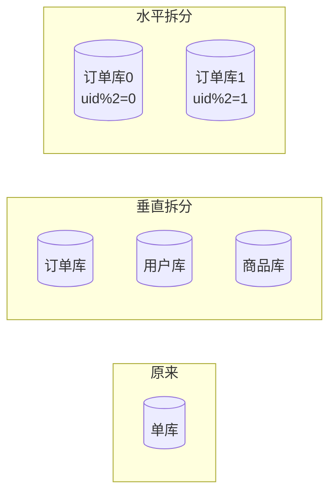
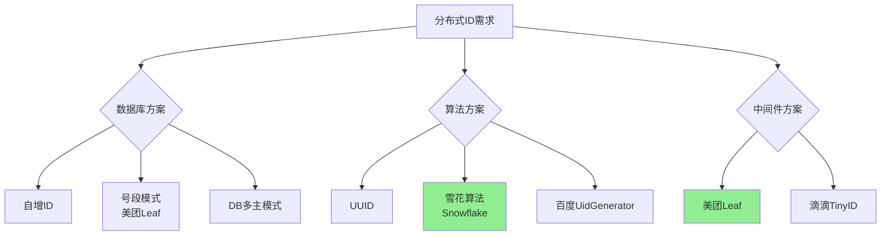

# 分布式系统面试八股文（四）——分布式存储与数据库中间件

> 🎯 **本文目标**：承接前三篇的理论/共识/事务，深入剖析分布式存储层的工程实践——分库分表策略与ShardingSphere实战、读写分离架构、NewSQL分布式数据库（TiDB/OceanBase）、分布式缓存集群、分布式ID生成方案、数据迁移与平滑扩容策略，构建分布式存储的完整知识体系。

---

## 一、分库分表：从问题到方案

### 1.1 为什么需要分库分表？

**Q1: 什么情况下需要分库分表？有没有阈值？**

```
单表数据量与性能的对应关系：

< 500万行      → 索引优化即可，无需分表
500万 ~ 2000万 → 考虑分区表、垂直拆分
2000万 ~ 5000万 → 水平分表，配合读写分离
> 5000万行     → 必须分库分表 + 中间件
```

**判断依据（不只看数据量）：**

| 指标 | 阈值 | 说明 |
|------|------|------|
| 单表行数 | >2000万 | B+树层级增加，IO次数增多 |
| 单表数据量 | >5GB | 备份/DDL耗时过长 |
| QPS | >1000 | 单库连接数不足 |
| 写入瓶颈 | 磁盘IO >70% | 写入成为瓶颈 |
| 业务耦合 | 非核心表影响核心业务 | 垂直拆分隔离 |

### 1.2 垂直拆分 vs 水平拆分

**Q2: 垂直拆分和水平拆分的区别？分别解决什么问题？**



| 维度 | 垂直拆分 | 水平拆分 |
|------|----------|----------|
| **拆分依据** | 按业务模块（订单、用户、商品） | 按数据行（uid hash） |
| **解决问题** | 业务耦合、连接数 | 单表数据量过大 |
| **实现难度** | 低（改数据源即可） | 高（路由、聚合、事务） |
| **扩展性** | 差（一个业务一个库） | 好（按需加库） |
| **跨库JOIN** | 少（业务内聚） | 多（需要中间件处理） |
| **典型场景** | 电商：订单/用户/商品独立库 | 订单表按用户ID分256个库 |

### 1.3 水平分片策略

**Q3: 常见的分片键选择策略有哪些？各有什么优劣？**

#### 策略一：取模（Mod）

```sql
-- 分4个库
库编号 = user_id % 4
表编号 = user_id % 16

-- 优点：数据分布均匀
-- 缺点：扩容需要全量迁移
```

#### 策略二：范围分片（Range）

```java
// 按时间范围
@Bean
public RangeShardingAlgorithm<Long> orderShardingAlgorithm() {
    return new RangeShardingAlgorithm<Long>() {
        @Override
        public Collection<String> doSharding(
                Collection<String> availableTargetNames, 
                RangeShardingValue<Long> shardingValue) {
            
            Range<Long> range = shardingValue.getValueRange();
            long lower = range.lowerEndpoint();
            
            // 2024年订单→ds_2024，2025年→ds_2025
            int year = LocalDate.ofEpochDay(lower).getYear();
            return Collections.singleton("ds_" + year);
        }
    };
}
// 优点：扩容简单，天然支持范围查询
// 缺点：热点数据不均（如最新订单全部写入最新库）
```

#### 策略三：哈希分片（一致性Hash）

```java
// 一致性哈希：虚拟节点减少数据倾斜
public class ConsistentHashSharding {
    
    private final TreeMap<Integer, String> ring = new TreeMap<>();
    private final int virtualNodes = 150;  // 虚拟节点数
    
    public void addNode(String node) {
        for (int i = 0; i < virtualNodes; i++) {
            int hash = hash(node + "#" + i);
            ring.put(hash, node);
        }
    }
    
    public String route(long key) {
        if (ring.isEmpty()) return null;
        
        int hash = hash(String.valueOf(key));
        // 顺时针找到第一个节点
        Map.Entry<Integer, String> entry = ring.ceilingEntry(hash);
        if (entry == null) {
            entry = ring.firstEntry();  // 环状：回到第一个
        }
        return entry.getValue();
    }
}
// 优点：扩容时只迁移少量数据
// 缺点：实现复杂，可能数据倾斜
```

#### 策略四：基因法（复合分片键）

```java
// 问题：订单号中嵌入用户基因
// order_id = timestamp + uid后6位 + 序列号
// 这样可以用order_id直接定位到用户所在的库

public class GeneSharding {
    
    public String generateOrderId(long userId) {
        String uidSuffix = String.format("%06d", userId % 1000000);
        long timestamp = System.currentTimeMillis();
        int sequence = sequenceGenerator.next();
        return timestamp + uidSuffix + String.format("%04d", sequence);
    }
    
    public String routeByOrderId(String orderId) {
        // 提取基因（uid后6位）
        String gene = orderId.substring(orderId.length() - 10, orderId.length() - 4);
        long uidGene = Long.parseLong(gene);
        // 按基因路由到用户所在库
        return "ds_" + (uidGene % shardCount);
    }
}
```

### 1.4 分库分表的分布式问题

**Q4: 分库分表后引入了哪些新问题？**

| 问题 | 描述 | 解决方案 |
|------|------|----------|
| **全局唯一ID** | 自增ID冲突 | 雪花算法、美团的Leaf |
| **跨库JOIN** | 无法直接JOIN | 字段冗余、应用层聚合、ER分片 |
| **跨库事务** | 分布式事务 | Seata、柔性事务 |
| **跨库分页** | ORDER BY + LIMIT | 全局排序/流式归并 |
| **扩容迁移** | 数据再分布 | 双写+灰度+数据迁移 |
| **数据聚合** | COUNT/SUM/AVG | 各分片计算后汇总 |
| **全局表** | 每个库都需要的小表 | 广播表（如字典表） |

---

## 二、ShardingSphere实战

### 2.1 架构概览

**Q5: ShardingSphere的架构是什么样的？JDBC和Proxy模式怎么选？**

```
ShardingSphere-JDBC:
┌──────────────────────────────────┐
│  Application                     │
│  ┌────────────────────────────┐  │
│  │ ShardingSphere-JDBC (JAR) │  │
│  │ ┌──────────┐ ┌──────────┐ │  │
│  │ │ 分片引擎  │ │ 治理中心  │ │  │
│  │ └──────────┘ └──────────┘ │  │
│  └────────────────────────────┘  │
│         │    │    │              │
│      ┌──┘    │    └──┐           │
│      ▼       ▼       ▼           │
│   MySQL   MySQL   MySQL          │
└──────────────────────────────────┘

ShardingSphere-Proxy:
┌──────────────────────────────────┐
│  Application → MySQL协议          │
│         │                        │
│         ▼                        │
│  ShardingSphere-Proxy (独立进程)  │
│         │    │    │              │
│      ┌──┘    │    └──┐           │
│      ▼       ▼       ▼           │
│   MySQL   MySQL   MySQL          │
└──────────────────────────────────┘
```

| 维度 | JDBC | Proxy |
|------|------|-------|
| **部署** | JAR包嵌入应用 | 独立进程 |
| **性能** | 高（无网络跳转） | 中（多一跳） |
| **语言** | 仅Java | 任何MySQL客户端 |
| **运维** | 随应用升级 | 独立运维 |
| **适用** | Java单体/微服务 | 多语言、DB中间件统一管理 |

### 2.2 分片配置实战

```yaml
# sharding-config.yml
dataSources:
  ds0:
    url: jdbc:mysql://localhost:3306/demo_ds_0
    username: root
    password: password
  ds1:
    url: jdbc:mysql://localhost:3306/demo_ds_1
    username: root
    password: password

rules:
  - !SHARDING
    tables:
      t_order:
        # 数据节点：ds0.t_order_0, ds0.t_order_1, ds1.t_order_0, ds1.t_order_1
        actualDataNodes: ds${0..1}.t_order_${0..1}
        
        # 分库策略
        databaseStrategy:
          standard:
            shardingColumn: user_id
            shardingAlgorithmName: database_inline
        
        # 分表策略  
        tableStrategy:
          standard:
            shardingColumn: order_id
            shardingAlgorithmName: table_inline
        
        # 分布式主键
        keyGenerateStrategy:
          column: order_id
          keyGeneratorName: snowflake
    
    # 绑定表：避免笛卡尔积
    bindingTables:
      - t_order,t_order_item
    
    # 广播表：每个库都有，数据一致
    broadcastTables:
      - t_config
      - t_district
    
    shardingAlgorithms:
      database_inline:
        type: INLINE
        props:
          algorithm-expression: ds${user_id % 2}
      
      table_inline:
        type: INLINE
        props:
          algorithm-expression: t_order_${order_id % 2}
    
    keyGenerators:
      snowflake:
        type: SNOWFLAKE
        props:
          worker-id: 1

  - !READWRITE_SPLITTING
    dataSources:
      ds_0:
        writeDataSourceName: ds0
        readDataSourceNames:
          - ds0_read1
          - ds0_read2
        loadBalancerName: round_robin
    
    loadBalancers:
      round_robin:
        type: ROUND_ROBIN
```

### 2.3 读写分离

**Q6: 读写分离如何实现？主从延迟怎么处理？**

```
                 ┌──────────────┐
                 │   Application │
                 └───────┬──────┘
                         │
                         ▼
              ┌─────────────────────┐
              │  ShardingSphere      │
              │                     │
              │  Write → Master     │
              │  Read  → Slave      │
              └──────┬──────────────┘
                     │
         ┌───────────┼───────────┐
         │           │           │
         ▼           ▼           ▼
    ┌────────┐ ┌────────┐ ┌────────┐
    │ Master │ │ Slave1 │ │ Slave2 │
    │ (写)    │→│ (读)    │ │ (读)    │
    └────────┘ └────────┘ └────────┘
         │    binlog复制  │
         └───────────────┘
```

**解决主从延迟的三种策略：**

```java
// 策略1：强制走主库（关键业务）
@Configuration
public class ReadWriteConfig {
    
    @Bean
    public HintShardingStrategyConfiguration hintStrategy() {
        // 使用Hint强制路由到主库
        return new HintShardingStrategyConfiguration(...);
    }
}

// 代码中使用
@Service
public class OrderService {
    
    public Order createAndQuery(OrderRequest req) {
        // 写操作 → 自动走主库
        orderMapper.insert(order);
        
        // 读操作 → 强制走主库（刚写入的）
        try (HintManager hintManager = HintManager.getInstance()) {
            hintManager.setWriteRouteOnly();  // 强制主库
            return orderMapper.selectById(order.getId());
        }
    }
}
```

```java
// 策略2：半同步复制（semi-sync replication）
// MySQL配置
SET GLOBAL rpl_semi_sync_master_enabled = 1;
SET GLOBAL rpl_semi_sync_master_timeout = 10000;  // 10s超时降级为异步

// 策略3：缓存补偿
@Service
public class CacheBasedReadService {
    
    @Autowired private RedisTemplate<String, Order> redisTemplate;
    
    public Order getOrder(Long orderId) {
        // 先查缓存
        Order cached = redisTemplate.opsForValue().get("order:" + orderId);
        if (cached != null) return cached;
        
        // 从库查询
        Order order = orderMapper.selectById(orderId);
        if (order != null) {
            redisTemplate.opsForValue().set("order:" + orderId, order, 10, TimeUnit.MINUTES);
        }
        return order;
    }
}
```

---

## 三、分布式数据库：NewSQL

### 3.1 TiDB

**Q7: TiDB的架构是什么样的？和MySQL有什么区别？**

```
TiDB 架构：
┌─────────────────────────────────────────────┐
│               TiDB (SQL层，无状态)               │
│  ┌─────────┐  ┌─────────┐  ┌─────────┐      │
│  │ TiDB-1  │  │ TiDB-2  │  │ TiDB-3  │      │
│  └────┬────┘  └────┬────┘  └────┬────┘      │
│       │            │            │            │
│       └────────────┼────────────┘            │
│                    │                         │
│  ┌─────────────────┼─────────────────┐      │
│  │           PD (调度层)               │      │
│  │   ┌──────┐  ┌──────┐  ┌──────┐    │      │
│  │   │ PD-1 │  │ PD-2 │  │ PD-3 │    │      │
│  │   └──────┘  └──────┘  └──────┘    │      │
│  └─────────────────┼─────────────────┘      │
│                    │                         │
│  ┌─────────────────┼─────────────────┐      │
│  │          TiKV (存储层)              │      │
│  │  ┌────────┐  ┌────────┐  ┌──────┐ │      │
│  │  │ TiKV-1 │  │ TiKV-2 │  │TiKV-3│ │      │
│  │  │Region-A│  │Region-B│  │Reg-C │ │      │
│  │  └────────┘  └────────┘  └──────┘ │      │
│  │      Raft复制 (3副本)               │      │
│  └────────────────────────────────────┘      │
└─────────────────────────────────────────────┘
```

| 维度 | MySQL | TiDB |
|------|-------|------|
| **扩展性** | 垂直扩展为主 | 水平弹性扩展 |
| **分布式事务** | XA（性能差） | 原生分布式事务（Percolator模型） |
| **高可用** | 主从 + MHA/Orchestrator | 原生Raft，自动故障转移 |
| **SQL兼容** | 100%原生 | ~95% MySQL兼容 |
| **HTAP** | 不支持 | TiFlash列存引擎 |
| **运维** | 需要分库分表中间件 | 开箱即用 |
| **适用** | 传统业务、单机足够 | 海量数据、弹性伸缩 |

**TiDB核心特性：**

```sql
-- 1. 自动分片，对应用透明
CREATE TABLE orders (
    id BIGINT PRIMARY KEY,
    user_id BIGINT,
    amount DECIMAL(10,2),
    INDEX idx_user (user_id)
);

-- 2. 在线DDL（不锁表）
ALTER TABLE orders ADD COLUMN status VARCHAR(20);

-- 3. 悲观事务 + 乐观事务可选
BEGIN PESSIMISTIC;
UPDATE orders SET status = 'paid' WHERE id = 1;
COMMIT;

-- 4. TiFlash：实时HTAP
ALTER TABLE orders SET TIFLASH REPLICA 1;
-- OLTP查询走TiKV，OLAP查询走TiFlash，自动路由
```

### 3.2 OceanBase

**Q8: OceanBase的核心特点是什么？**

OceanBase是蚂蚁集团自研的原生分布式数据库，特点：

| 特性 | 说明 |
|------|------|
| **准内存数据库** | 增量数据在内存，基线数据在SSD |
| **多租户** | 原生多租户隔离（数据库级别） |
| **高压缩比** | 行列混合存储 + 自适应压缩 |
| **Oracle兼容** | 高度兼容Oracle语法和PL/SQL |
| **两地三中心** | 原生支持同城双活+异地灾备 |
| **Paxos** | 基于Multi-Paxos的一致性协议 |

---

## 四、分布式缓存架构

### 4.1 Redis集群架构

**Q9: Redis集群模式有哪些？如何选型？**

```
Redis集群演进：

主从复制 → 哨兵模式 → Redis Cluster → Proxy模式（Codis/Twemproxy）
  │           │            │                │
 读写分离   自动故障转移   去中心化         中心化代理
 手动切换   不能扩容       数据分片         运维简单
```

```java
// Spring Boot配置Redis Cluster
@Configuration
public class RedisClusterConfig {
    
    @Bean
    public RedisConnectionFactory redisConnectionFactory() {
        RedisClusterConfiguration clusterConfig = 
            new RedisClusterConfiguration();
        
        clusterConfig.clusterNode("192.168.1.1", 6379);
        clusterConfig.clusterNode("192.168.1.2", 6379);
        clusterConfig.clusterNode("192.168.1.3", 6379);
        clusterConfig.clusterNode("192.168.1.4", 6379);
        clusterConfig.clusterNode("192.168.1.5", 6379);
        clusterConfig.clusterNode("192.168.1.6", 6379);
        
        clusterConfig.setMaxRedirects(3);
        
        LettuceClientConfiguration clientConfig = 
            LettuceClientConfiguration.builder()
                .commandTimeout(Duration.ofSeconds(2))
                .build();
        
        return new LettuceConnectionFactory(clusterConfig, clientConfig);
    }
}
```

### 4.2 多级缓存架构

**Q10: 如何设计多级缓存架构？**

```
┌──────────────────────────────────────────────────┐
│              多级缓存架构                          │
├──────────────────────────────────────────────────┤
│                                                  │
│  浏览器/客户端                                     │
│      │ Http Cache-Control, ETag                  │
│      ▼                                           │
│  CDN（边缘缓存）                                   │
│      │ 静态资源、热点内容                           │
│      ▼                                           │
│  本地缓存（Caffeine/Guava）                        │
│      │ 进程内、纳秒级、JVM内存限制                   │
│      ▼                                           │
│  分布式缓存（Redis Cluster）                       │
│      │ 毫秒级、集群可扩展                           │
│      ▼                                           │
│  数据库（MySQL/TiDB）                             │
│      │ 持久化、强一致                              │
│      ▼                                           │
│  兜底/降级数据                                     │
│                                                  │
└──────────────────────────────────────────────────┘
```

```java
@Service
public class MultiLevelCacheService {
    
    @Autowired private Cache<String, Product> localCache;  // Caffeine
    @Autowired private RedisTemplate<String, Product> redisTemplate;
    @Autowired private ProductMapper productMapper;
    
    public Product getProduct(Long productId) {
        String key = "product:" + productId;
        
        // L1: 本地缓存
        Product product = localCache.getIfPresent(key);
        if (product != null) {
            metricsCollector.recordHit("L1");
            return product;
        }
        
        // L2: Redis
        product = redisTemplate.opsForValue().get(key);
        if (product != null) {
            localCache.put(key, product);  // 回填L1
            metricsCollector.recordHit("L2");
            return product;
        }
        
        // L3: 数据库
        product = productMapper.selectById(productId);
        if (product != null) {
            // 异步回填缓存（避免缓存击穿）
            cacheExecutor.execute(() -> {
                redisTemplate.opsForValue().set(key, product, 
                    30 + ThreadLocalRandom.current().nextInt(10),
                    TimeUnit.MINUTES);
                localCache.put(key, product);
            });
            metricsCollector.recordHit("L3");
            return product;
        }
        
        // 缓存空对象防穿透
        redisTemplate.opsForValue().set(key + ":null", "1", 5, TimeUnit.MINUTES);
        return null;
    }
}
```

### 4.3 缓存一致性策略

**Q11: 如何保证缓存与数据库的一致性？**

```
Cache-Aside模式（最常用）：

读：先读缓存 → miss → 读DB → 写回缓存
写：先写DB → 后删缓存

        Client
          │
    ┌─────┴─────┐
    │           │
    ▼           ▼
  缓存        数据库
  (先删？     (先写？
   后写？)     后删？)
```

```java
@Service
public class CacheConsistencyService {
    
    @Autowired private ProductMapper productMapper;
    @Autowired private RedisTemplate<String, Product> redisTemplate;
    
    /**
     * 更新策略：先更新数据库，再删除缓存
     * 延迟双删解决极端不一致
     */
    @Transactional
    public void updateProduct(Product product) {
        String key = "product:" + product.getId();
        
        // Step 1: 先删除缓存（第一次删除）
        redisTemplate.delete(key);
        
        // Step 2: 更新数据库
        productMapper.updateById(product);
        
        // Step 3: 延迟第二次删除（异步，500ms后）
        delayDeleteExecutor.schedule(() -> {
            redisTemplate.delete(key);
        }, 500, TimeUnit.MILLISECONDS);
    }
    
    /**
     * Canal + Binlog 方案：终极一致性
     * 监听MySQL binlog，异步更新缓存
     */
    @Component
    public class BinlogCacheSync {
        
        @EventListener
        public void onProductChanged(ProductChangedEvent event) {
            // Canal已经监听到binlog变化
            // 异步更新/删除缓存
            redisTemplate.delete("product:" + event.getProductId());
        }
    }
}
```

**Canal监听Binlog方案：**

```yaml
# canal配置
canal:
  server: 192.168.1.100:11111
  destination: example
  
# 消费binlog，同步缓存
@Component
public class CanalCacheHandler implements EntryHandler<Product> {
    
    @Autowired private RedisTemplate<String, Product> redisTemplate;
    
    @Override
    public void insert(Product product) {
        // 新数据写入缓存
        redisTemplate.opsForValue().set(
            "product:" + product.getId(), 
            product, 
            30, TimeUnit.MINUTES
        );
    }
    
    @Override
    public void update(Product before, Product after) {
        // 删除缓存，等待下次读取时重建
        redisTemplate.delete("product:" + after.getId());
    }
    
    @Override
    public void delete(Product product) {
        redisTemplate.delete("product:" + product.getId());
    }
}
```

---

## 五、分布式ID生成方案

### 5.1 方案全景对比

**Q12: 分布式ID生成有哪些方案？生产环境用哪个？**



| 方案 | 优点 | 缺点 | 性能 | 适用 |
|------|------|------|------|------|
| **UUID** | 简单，无中心节点 | 长字符串，无序，不友好 | 极高 | 非关键路径 |
| **数据库自增** | 简单递增 | 单点瓶颈 | 低 | 小规模 |
| **号段模式** | 高性能，趋势递增 | DB依赖 | 极高 | 美团Leaf-segment |
| **雪花算法** | 高性能，趋势递增，去中心化 | 时钟回拨问题 | 极高 | ⭐首选 |
| **Redis自增** | 简单 | 持久化问题 | 高 | 中等规模 |

### 5.2 雪花算法精讲

**Q13: 雪花算法的结构是怎样的？时钟回拨怎么处理？**

```
Snowflake ID结构（64位）：
┌─┬──────────────────────────────┬───────────┬────────────┐
│0│        41位时间戳（ms）        │ 10位机器ID │ 12位序列号   │
└─┴──────────────────────────────┴───────────┴────────────┘
  最高位（不用）    可用69年        1024个节点   4096/ms/节点

理论QPS：4096 * 1024 = ~400万/秒
```

```java
public class SnowflakeIdGenerator {
    
    // 起始时间戳：2024-01-01 00:00:00
    private final long START_TIMESTAMP = 1704038400000L;
    
    private final long WORKER_ID_BITS = 10L;
    private final long SEQUENCE_BITS = 12L;
    
    private final long MAX_WORKER_ID = ~(-1L << WORKER_ID_BITS);  // 1023
    private final long MAX_SEQUENCE = ~(-1L << SEQUENCE_BITS);    // 4095
    
    private final long WORKER_ID_SHIFT = SEQUENCE_BITS;
    private final long TIMESTAMP_SHIFT = SEQUENCE_BITS + WORKER_ID_BITS;
    
    private long workerId;
    private long sequence = 0L;
    private long lastTimestamp = -1L;
    private long lastBackupTimestamp = -1L;  // 时钟回拨备份
    
    public SnowflakeIdGenerator(long workerId) {
        if (workerId > MAX_WORKER_ID || workerId < 0) {
            throw new IllegalArgumentException("Worker ID must be 0-1023");
        }
        this.workerId = workerId;
    }
    
    public synchronized long nextId() {
        long currentTimestamp = System.currentTimeMillis();
        
        // 时钟回拨处理
        if (currentTimestamp < lastTimestamp) {
            long offset = lastTimestamp - currentTimestamp;
            
            if (offset <= 5) {
                // 回拨小于5ms → 等待追上
                try {
                    Thread.sleep(offset + 1);
                    currentTimestamp = System.currentTimeMillis();
                } catch (InterruptedException e) {
                    Thread.currentThread().interrupt();
                    throw new RuntimeException("Interrupted during clock fix");
                }
            } else if (offset > 5 && lastBackupTimestamp < currentTimestamp) {
                // 回拨大于5ms → 使用备用时间戳
                lastBackupTimestamp = currentTimestamp;
                log.warn("Clock moved backwards by {}ms, using backup timestamp", offset);
            } else {
                // 多次回拨 → 抛异常，启动时钟同步
                throw new RuntimeException(
                    "Clock moved backwards, refusing to generate ID. Offset: " + offset + "ms"
                );
            }
        }
        
        if (currentTimestamp == lastTimestamp) {
            // 同一毫秒内：序列号递增
            sequence = (sequence + 1) & MAX_SEQUENCE;
            if (sequence == 0) {
                // 序列号用完 → 等待下一毫秒
                currentTimestamp = waitNextMillis(lastTimestamp);
            }
        } else {
            // 不同毫秒：序列号归零
            sequence = 0L;
        }
        
        lastTimestamp = currentTimestamp;
        
        return ((currentTimestamp - START_TIMESTAMP) << TIMESTAMP_SHIFT)
             | (workerId << WORKER_ID_SHIFT)
             | sequence;
    }
    
    private long waitNextMillis(long lastTimestamp) {
        long timestamp = System.currentTimeMillis();
        while (timestamp <= lastTimestamp) {
            timestamp = System.currentTimeMillis();
        }
        return timestamp;
    }
}
```

### 5.3 美团Leaf方案

**Q14: 美团的Leaf-segment模式是怎么实现的？**

```sql
-- Leaf DB表结构
CREATE TABLE leaf_alloc (
    biz_tag     VARCHAR(128) NOT NULL DEFAULT '' COMMENT '业务标识',
    max_id      BIGINT(20) NOT NULL DEFAULT 1 COMMENT '已分配最大ID',
    step        INT(11) NOT NULL COMMENT '号段步长',
    description VARCHAR(256) DEFAULT NULL,
    update_time TIMESTAMP NOT NULL DEFAULT CURRENT_TIMESTAMP ON UPDATE CURRENT_TIMESTAMP,
    PRIMARY KEY (biz_tag)
);
```

```java
// Leaf-segment核心逻辑
@Service
public class LeafSegmentService {
    
    // 双buffer设计：当前段用完时已异步准备好下一段
    private volatile Segment currentSegment;
    private volatile Segment nextSegment;
    private final ExecutorService asyncExecutor = Executors.newSingleThreadExecutor();
    
    public synchronized Result getId(String key) {
        // 当前段用完 → 切换
        if (currentSegment == null || currentSegment.getIdle() <= 0) {
            if (nextSegment != null) {
                currentSegment = nextSegment;
                nextSegment = null;
            } else {
                // 两个段都耗尽 → 等待
                currentSegment = loadSegment(key);
            }
        }
        
        long id = currentSegment.getIdleAndIncrement();
        
        // 异步加载下一段
        if (currentSegment.getIdle() < currentSegment.getStep() * 0.1 
                && nextSegment == null) {
            asyncExecutor.execute(() -> {
                nextSegment = loadSegment(key);
            });
        }
        
        return new Result(id, Status.SUCCESS);
    }
    
    private Segment loadSegment(String key) {
        // UPDATE leaf_alloc SET max_id = max_id + step WHERE biz_tag = ?
        // 返回更新后的max_id
        long newMaxId = leafAllocMapper.updateMaxId(key);
        return new Segment(newMaxId - step, newMaxId, step);
    }
}
```

---

## 六、数据迁移与平滑扩容

### 6.1 停机迁移 vs 平滑迁移

**Q15: 如何从单库平滑迁移到分库分表？如何平滑扩容？**

```
平滑迁移五步法：

Step 1: 双写（新库 + 旧库）
        Application
           │
           ├──→ 旧库（单库） —— 写入
           └──→ 新库（分库） —— 写入
        读：仍从旧库读

Step 2: 历史数据迁移
        离线任务全量迁移 → 增量Binlog同步

Step 3: 数据校验
        行数对比 + 抽样校验

Step 4: 灰度切读
        5% → 20% → 50% → 100% 读切到新库

Step 5: 下线旧库
        观察期（1-2周）→ 停写旧库 → 下线
```

```java
// 双写灰度实现
@Component
public class MigrationWriteHandler {
    
    @Autowired private OldOrderMapper oldMapper;
    @Autowired private ShardingOrderMapper newMapper;
    @Autowired private MigrationConfig config;
    
    public void createOrder(Order order) {
        long orderId = idGenerator.nextId();
        order.setId(orderId);
        
        if (config.isWriteNewFlag(order.getUserId())) {
            // 新库写入
            newMapper.insert(order);
            
            if (config.isDoubleWrite()) {
                // 双写：同时写旧库
                try {
                    oldMapper.insert(order);
                } catch (Exception e) {
                    log.warn("Double write to old DB failed", e);
                }
            }
        } else {
            // 旧库写入
            oldMapper.insert(order);
        }
    }
}

// 灰度配置（Apollo/Nacos动态配置）
@ConfigurationProperties(prefix = "migration")
@Component
public class MigrationConfig {
    private boolean doubleWrite = true;     // 是否双写
    private int readNewPercent = 0;          // 新库读比例（0-100）
    private int writeNewPercent = 100;       // 新库写比例（0-100）
    
    public boolean isWriteNewFlag(Long userId) {
        return (Math.abs(userId.hashCode()) % 100) < writeNewPercent;
    }
}
```

### 6.2 扩容策略

**Q16: 分库从4个扩容到8个，如何实现？**

```
方案：一致性哈希 + 虚拟节点

原配置（4节点）：
┌─────────────────────────────────────────┐
│  Node0: hash ∈ [0, 2^32/4)              │
│  Node1: hash ∈ [2^32/4, 2^32/2)         │
│  Node2: hash ∈ [2^32/2, 3*2^32/4)       │
│  Node3: hash ∈ [3*2^32/4, 2^32)         │
└─────────────────────────────────────────┘

扩容后（8节点）：
┌─────────────────────────────────────────┐
│  每个老节点分裂为2个新节点                   │
│  只需迁移约50%的数据（而非全量）              │
└─────────────────────────────────────────┘

迁移步骤：
1. 新增4个库（ds4-ds7）
2. 双写开始（同时写新分区和旧分区）
3. 异步迁移历史数据
4. 数据校验通过
5. 切换路由规则
6. 清理旧数据
```

---

## 七、面试高频问题速览

| # | 问题 | 难度 | 关键点 |
|---|------|------|--------|
| 1 | 分库分表后如何跨库分页？ | ⭐⭐⭐⭐ | 流式归并/全局排序/应用层聚合 |
| 2 | 雪花算法时钟回拨怎么处理？ | ⭐⭐⭐ | 等待/备用时间戳/抛异常 |
| 3 | TiDB和分库分表中间件选型？ | ⭐⭐⭐⭐ | 数据量/运维成本/事务需求 |
| 4 | 缓存和数据库一致性？ | ⭐⭐⭐⭐ | Cache-Aside + 延迟双删 + Canal |
| 5 | ShardingSphere-JDBC vs Proxy？ | ⭐⭐⭐ | 性能vs通用性 |
| 6 | 分片键怎么选？ | ⭐⭐⭐ | 避免热点、考虑扩容、基因法 |
| 7 | 分布式ID有哪几种？ | ⭐⭐ | UUID/DB自增/雪花/Leaf |
| 8 | 从单库到分库如何平滑迁移？ | ⭐⭐⭐⭐ | 双写+灰度+校验 |

---

## 八、总结

分布式存储是分布式系统最底层的工程挑战。从分库分表的策略选择，到ShardingSphere这样的中间件，再到TiDB这样的NewSQL数据库，理解每种方案背后的**设计权衡**是面试的核心竞争力。

**核心要点**：
1. **分库分表**：垂直解耦 + 水平扩展，选好分片键是成败关键
2. **ShardingSphere**：JDBC高性能，Proxy通用高，根据场景选择
3. **读写分离**：主从延迟用强制主库/半同步/Canal缓存方案
4. **分布式数据库**：TiDB原生分布式，OceanBase准内存+Oracle兼容
5. **分布式缓存**：多级缓存 + Cache-Aside + Canal Binlog最终一致
6. **分布式ID**：雪花算法首选，Leaf-segment性能最佳
7. **平滑迁移**：双写 + 灰度切流 + 四阶段校验

> 📚 **下期预告**：《分布式系统面试八股文（五）——分布式服务治理与服务网格》，深入解析服务注册发现、配置中心、API网关、负载均衡、限流熔断、链路追踪与服务网格（Service Mesh），敬请期待！
